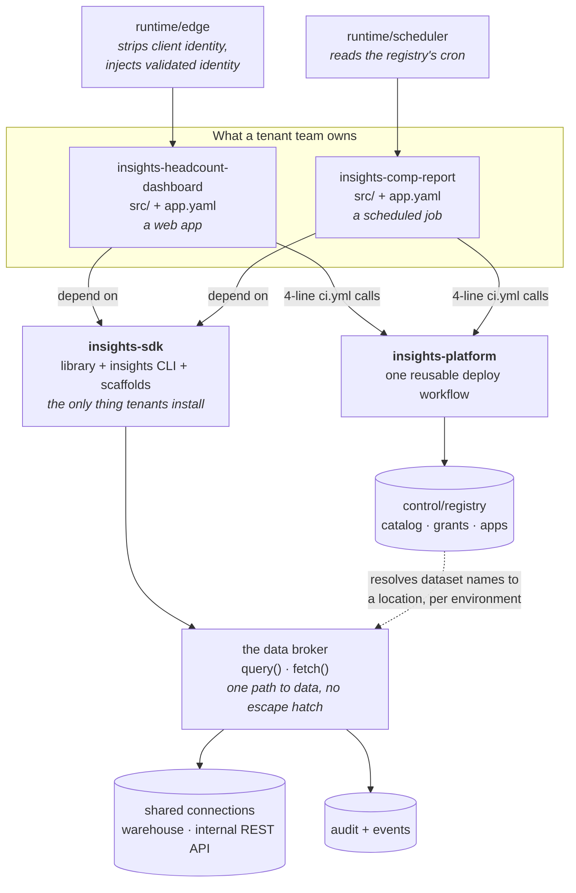

# Insights Hub

An internal platform for small analytics apps — dashboards, scheduled reports, data
explorers — built for teams who currently hand-roll auth, data access, deployment and
logging for every one of them.

**This is the root of the submission.** It's four repositories; this one is the platform,
and everything is indexed from here.

---

## The whole thing in one picture



**Read it as one sentence:** *a team writes app code and an `app.yaml`, depends on the SDK,
and calls one platform workflow — and in return gets identity, data access, deployment and
observability without writing any of them.*

The one decision everything else rests on is in that diagram: **tenants never get a
connection.** They name a dataset; the platform performs the read. That's what makes
entitlement, masking and audit enforceable rather than advisory
([ADR-002](docs/adr/0002-tenant-isolation-and-data-access.md)).

---

## Read this in ten minutes

| If you have | Read |
|---|---|
| **2 minutes** | this page, down to *"The shape of it"* |
| **10 minutes** | [`docs/ARCHITECTURE.md`](docs/ARCHITECTURE.md) — the whole system in one document |
| **30 minutes** | [ADR-002](docs/adr/0002-tenant-isolation-and-data-access.md) and [ADR-003](docs/adr/0003-operator-access-and-tenant-data.md) — the two decisions most worth arguing with |
| **an hour** | all five [ADRs](docs/adr/), then [`ONBOARDING.md`](ONBOARDING.md) to see what it feels like to a tenant |

**If you only read one thing:** [`docs/ARCHITECTURE.md`](docs/ARCHITECTURE.md).

---

## Run it

Four repositories, side by side in one directory:

```bash
mkdir insights-hub && cd insights-hub
git clone https://github.com/KRISHNABR/insights-platform.git
git clone https://github.com/KRISHNABR/insights-sdk.git
git clone https://github.com/KRISHNABR/insights-headcount-dashboard.git
git clone https://github.com/KRISHNABR/insights-comp-report.git
```

The directory names matter — the local dev loop finds the sibling repos by name. (In
production none of this applies: the SDK is pip-installed and the registry is mounted.)

Then, from `insights-platform/`:

```bash
./dev up
```

That seeds a stub warehouse, starts a stub internal REST API, starts every registered
app, and puts the platform edge on `localhost:8080`. Requires Python 3.11+ and
[`uv`](https://docs.astral.sh/uv/); nothing else, and no cloud account.

(If something already has port 8080, `./dev up --port 9100` moves the whole stack. It
checks before starting anything rather than failing on the third process.)

```bash
# sign in — appending ?as= is the whole local login
open "http://localhost:8080/a/headcount-dashboard/?as=dana@corp.example"

# read the warehouse, through the broker
curl "http://localhost:8080/a/headcount-dashboard/headcount?month=2026-09"

# read the internal REST API — different connection, same broker
curl "http://localhost:8080/a/headcount-dashboard/team?dept=Engineering"
```

In another shell:

```bash
./dev status                                          # every app, four facts each
./dev compliance-report --dataset hr.compensation     # what a reviewer gets handed
python runtime/scheduler/main.py --all                # run the scheduled job now
```

And the test suite, from `insights-sdk/`:

```bash
uv run --with pytest --with pyyaml --with fastapi python -m pytest -q      # 31 tests
```

### Three things worth trying, because they're the design

```bash
# 1. Knowing a dataset's name is not access.
#    sales.pipeline is real and has rows. This app didn't declare it.
curl "http://localhost:8080/a/headcount-dashboard/headcount"   # works
# ...then add sales.pipeline to a query in src/main.py → EntitlementError

# 2. A client cannot assert its own identity.
#    Signed in as Dana, who is not a comp-analyst:
curl -b cookies.txt \
     -H "X-Auth-User: ceo@corp.example" \
     -H "X-Auth-Groups: comp-analyst" \
     "http://localhost:8080/a/headcount-dashboard/"
# → still Dana. The edge strips those headers before the app ever sees them.

# 3. A tenant cannot declare its own data sensitive-or-not.
#    Add `classification: internal` to a dataset in any app.yaml → the manifest is rejected,
#    at runtime AND in CI. Sensitivity belongs to the data owner, not to the app team.
```

---

## The shape of it

**The tenant contract:** *you write your app logic and an `app.yaml`. Everything else is
inherited.*

| Repository | Who touches it | What's in it |
|---|---|---|
| [`insights-sdk`](https://github.com/KRISHNABR/insights-sdk) | **tenants**, as a dependency | the library, the `insights` CLI, the scaffold templates |
| `insights-platform` *(here)* | **platform team only** | `runtime/` · `control/` · the reusable CI workflow · docs and ADRs |
| [`insights-headcount-dashboard`](https://github.com/KRISHNABR/insights-headcount-dashboard) | tenant | example: interactive web app |
| [`insights-comp-report`](https://github.com/KRISHNABR/insights-comp-report) | tenant | example: scheduled job, restricted data |

```
insights-platform/
├── docs/
│   ├── ARCHITECTURE.md          ← the system, end to end
│   └── adr/                     ← five decision records
├── ONBOARDING.md                ← day one for team #6
├── COMPLIANCE.md                ← the control catalogue, for a reviewer
├── control/
│   ├── registry/
│   │   ├── catalog.yaml         connections + datasets. The access registry
│   │   ├── grants.yaml          the second key for restricted data
│   │   └── apps.json            what is deployed (written by CI; by `up` locally)
│   └── cli/gates.py             the CI-layer rules
├── runtime/
│   ├── edge/                    identity. The most important 120 lines here
│   ├── scheduler/               what makes `kind: job` mean something
│   ├── base-image/              what 25 apps build FROM
│   ├── fakes/                   stub warehouse + stub internal REST API
│   └── sinks/                   events.jsonl + audit.jsonl
└── .github/workflows/deploy.yml the one pipeline every tenant calls
```

**Two ideas most of the design falls out of:**

1. **Declare, don't wire.** A tenant declares intent — a dataset name, a role, a
   schedule. The platform resolves it to an engine, a credential, a group, a cron slot.
2. **Enforce at the earliest layer that makes a rule impossible to get wrong.**
   Generator → SDK runtime → CI → human review → documentation last.

And the ownership line that follows: **you own your code, we own the road it travels on.**

---

## The questions the brief asked

Each is answered properly in an ADR; these are the one-line versions.

**Reuse and upgrade** — a versioned SDK, installed as a dependency, with the CLI and
scaffolds inside it. Tenants declare a floor (`>=0.1,<1`), never a pin, so patches and
minors flow automatically. The upgrade story with twelve dependants rests on
**deprecation telemetry**: a deprecated call emits an event naming the app, version and
symbol, so migration is a list of four teams rather than a broadcast email. Majors are
cut when that list empties, not on a date.
→ [ADR-001](docs/adr/0001-platform-shape-and-reuse-strategy.md)

**Isolation, and shared data connections** — the platform **brokers reads; it never hands
out a connection.** Sharing a connection means sharing a credential, and then nothing
stops the headcount dashboard selecting salaries. Tenants name a logical dataset; the
platform resolves connection, engine and location. Governance — ownership, sensitivity,
grants, column masks, row filters — is **delegated to Unity Catalog** rather than
reimplemented, because a second governance model beside the data platform's is a second
source of truth that drifts silently. Isolation is soft by default, with a restricted tier
triggered by the **data's sensitivity, not the tenant's identity**.
→ [ADR-002](docs/adr/0002-tenant-isolation-and-data-access.md)

**Operator access** — telemetry structurally cannot carry payloads: the logger *raises*
at the emit point rather than scrubbing at the sink, because scrubbing fails open. The
platform team has no standing access to tenant rows; break-glass is time-boxed,
approved by the **dataset owner** rather than by us, audited, and the tenant is notified.
We also write down the hole we can't close: the broker is in-process, so the credential
sits in the tenant's container.
→ [ADR-003](docs/adr/0003-operator-access-and-tenant-data.md)

**Enforcement** — each rule goes to the earliest layer that makes it impossible to get
wrong. The diagnostic: *what does the day-one guide have to warn people about?* Every
warning is a control sitting one layer too late.
→ [ADR-004](docs/adr/0004-enforcement-and-platform-rules.md)

**Deliberate omissions** — eleven of them, each with the trigger that reverses it. No
portal, no policy engine, no per-tenant infrastructure, no multi-environment promotion,
**no data discovery**, no per-user credential passthrough, no federation to an
enterprise data catalog.
→ [ADR-005](docs/adr/0005-deliberate-omissions-and-triggers.md)

---

## What I'd do next

In order, with the reason — a sequence, not a backlog.

**1. Real infrastructure as code, and a second environment.**
`infra/` describes the target; it deploys nothing. This is the omission that most weakens the
phrase "production grade", and it is the one I'd close first. I'd write it as CDK in Python:
it produces CloudFormation, so it fits an organisation whose standard is CloudFormation, it is
the same language as the platform, and it synthesises and unit-tests without an AWS account.
Environments already exist in the manifest and the workflows — they are simply not exercised.

**2. The identity bridge, for real.** The design says an interactive app exchanges the user's
session for a short-lived Databricks token, so Unity Catalog sees the actual person. That is
the single most valuable thing in the design and the most likely to be fiddly: token lifetime,
refresh, what happens mid-session when a grant is revoked. It is structural in the code and
not wired, and I'd rather say so than imply otherwise.

**3. Periodic access review.** The compliance partner will ask and we don't have it. All the
inputs exist — UC grants, UC audit, owners — so this is a report and a cadence, not new
machinery.

**4. Make `insights status` answer "is it broken?" rather than "did it run?"**
It reports last-seen and version: enough for five apps, thin for twenty-five. The next
increment is error rate and last failure per app, from telemetry we already emit.

**5. A second engine adapter, chosen by a real tenant.** The claim that "adding an engine
inherits every control for free" is true in the code and unproven in practice. The first real
request tests it, and I'd rather find out on someone's object store than assume.

**6. Machine-to-machine exposure.** The first system or agent that wants to call an app as a
tool needs API Gateway in front of the same services — and, more interestingly, a decision
about what a non-human caller's identity means for `require_role()` and for the Unity Catalog
grant it reads under. That is a design question, not a gateway question.

### And the thing I'd change about what's here

The data API is narrow on purpose — two verbs, no escape hatch — and I think that's right, but
it's the decision most likely to be wrong. The signal to watch is the rate of "can the platform
add X" tickets. A slow trickle means the API is well-judged. A steady stream means the platform
team has become a queue, and the honest response then isn't an escape hatch — it's a data
service that other languages and other shapes of query can reach (ADR-002 alternative D).

## Notes on scope

Time budget was 10–12 hours, and the brief says it scores prioritisation rather than
endurance. Where I spent it:

| | Why |
|---|---|
| **ADRs and docs (~45%)** | the brief says ADRs first, code second, and means it |
| **The data broker and its tests (~30%)** | it's the decision everything else rests on, so it needed to be real rather than described |
| **Runtime, CLI, CI, examples (~25%)** | enough to prove the model runs end to end |

What I deliberately didn't polish: no web UI for status (the CLI has the same data), no
Docker Compose (the CLI orchestrates the local stack in one command), no retries or
backfill in the scheduler. Each of those would have looked more finished and taught a
reader less.

**Three things surfaced by building rather than designing**, all of which changed the design
and are the reason the code was worth writing:

- A scheduled job has no human caller, so "may this caller see salaries?" has no answer
  from corporate groups. The tempting fix — read `access.roles` from the manifest — lets
  a team unmask compensation by editing its own repo. The roles now come from the
  **grant**, which only the dataset owner can write.
- An undeclared dataset and a nonexistent one now return the *same* error, because a
  differentiated error would let any tenant enumerate the registry by guessing names.
  That's a discovery oracle, and there's a test asserting the two errors stay identical.
- Mounting the example app's frontend at `/` silently shadowed **every** API route, because
  the mount is registered before the tenant's own decorators run. It now mounts on startup,
  so the catch-all is genuinely last. Nothing about that is visible from reading the design.
