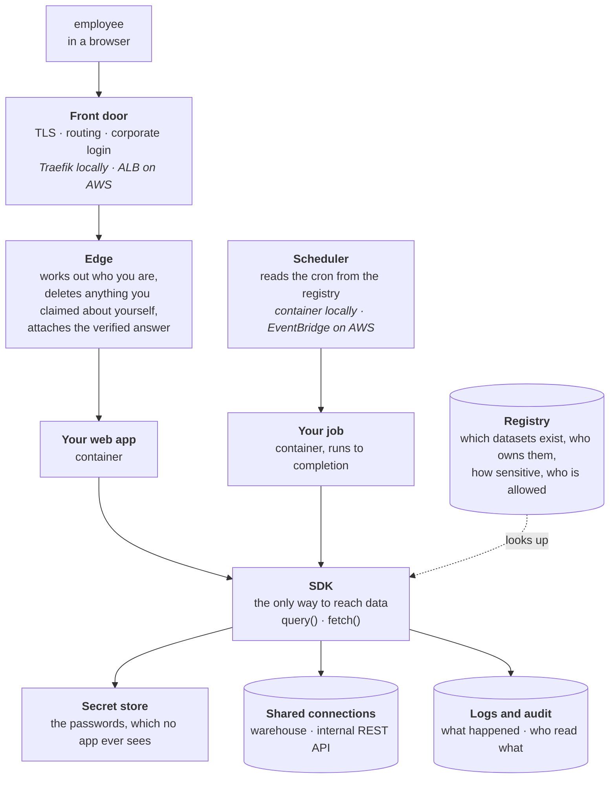
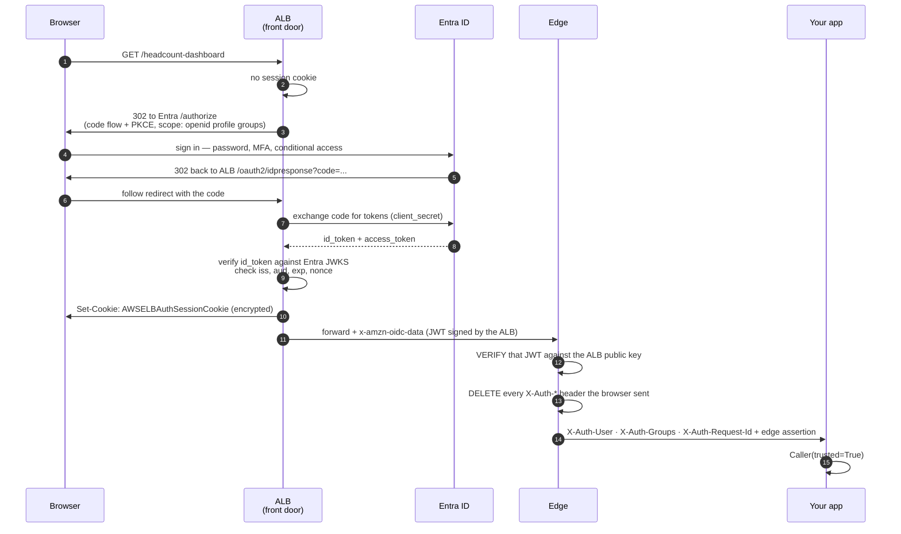
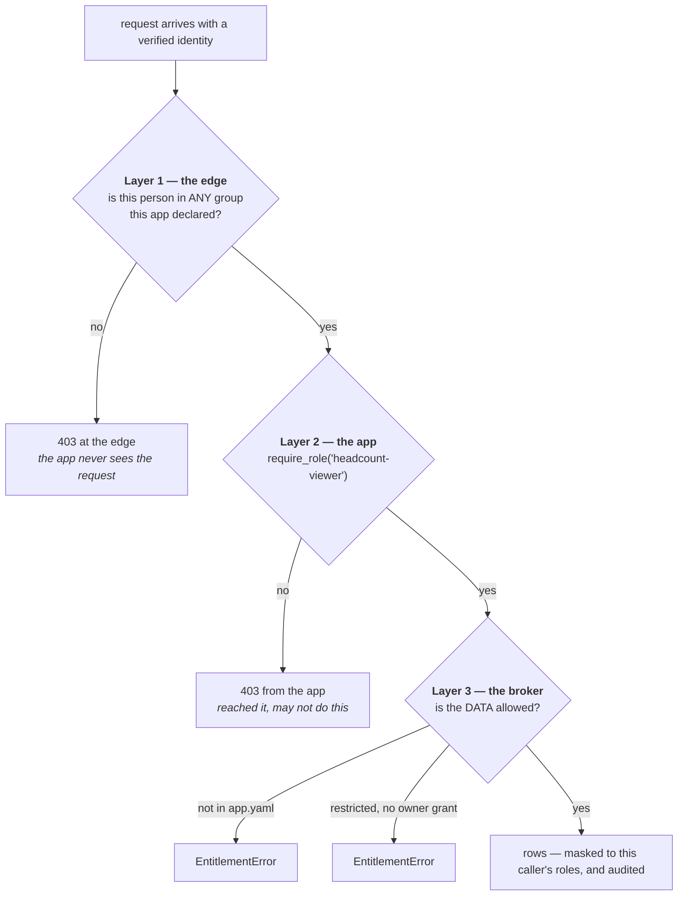
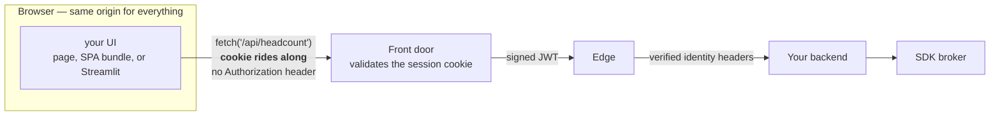
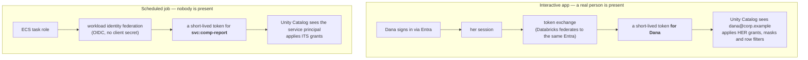
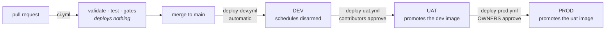
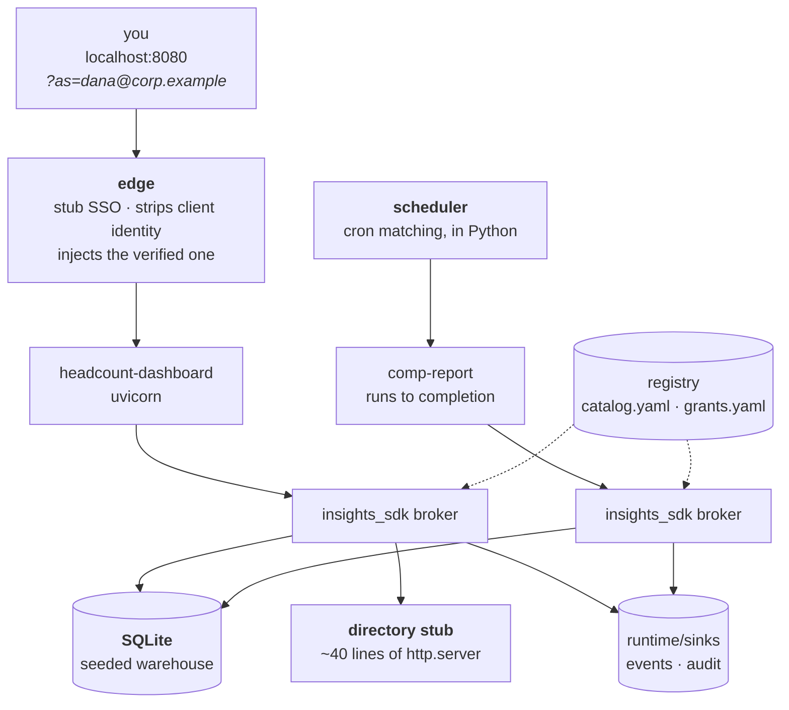
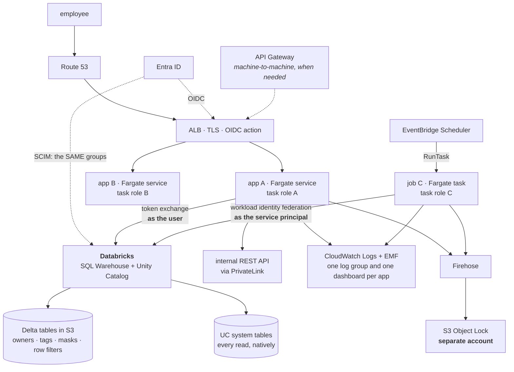

# Insights Hub — architecture

*How the system is built and how it runs. Plain English, no decision history — the
[ADRs](adr/) hold the arguments about why. If you want to know **what happens when someone
opens an app, or when a job fires at 6am**, this is the page.*

---

## 1 · What this is, in plain terms

Teams across the company build small internal apps — a headcount dashboard, a weekly
compensation report, a pipeline explorer. Today each team writes their own login, their own
database connection, their own deployment and their own logging. Five teams have built the
same five things five times, slightly differently, and nobody can answer *"who read the
salary table last month?"*

Insights Hub is the shared foundation underneath those apps. A team writes their app logic
and one configuration file. They get login, permissions, data access, deployment across three
environments, logging and monitoring — without writing any of it.

**The one rule that shapes everything else:** the platform never hands a team a database
password. A team says *"I need the headcount data"* and the platform fetches it for them.
That single choice is what makes it possible to answer who read what, and to stop the
headcount dashboard from reading salaries.

---

## 2 · Tech stack — and the two layers

There are two different questions here, and the answer to each is different.

> **What runs on your laptop** is deliberately tiny: Python, SQLite, two stdlib stub
> services. One command, no Docker, no cloud account, no credentials.
>
> **What this becomes in production** is a recommendation, in **two layers**:
> **AWS for the application layer, Databricks for the data layer.** None of it is built
> here — §10 is the target architecture, not a description of this repository.

The point of the split is that the seam between them is one function per concern, so the
recommendation is reachable rather than aspirational.

### What actually runs locally

| Concern | Local — what this repo runs | Why so small |
|---|---|---|
| Language | Python 3.12, **uv** | One toolchain, one lockfile |
| Web | FastAPI + uvicorn | Already a dependency of the SDK |
| Front door / login | the platform **edge**, `?as=dana@corp.example` | A stubbed IdP is still a real trust boundary — see §6 |
| Warehouse | **SQLite file**, seeded by a script | Zero setup. `hr.headcount` is a real table with real rows |
| Internal REST API | ~40 lines of `http.server` | Proves a second connection type goes through the same broker |
| Secrets | environment variables the CLI injects | Stands in for a credential the app never chooses |
| Scheduling | the platform **scheduler**, cron matching in Python | Makes `kind: job` mean something |
| Logs, metrics, audit | JSON lines to stdout → `runtime/sinks/` | Append-only files with the right shape |
| Registry | two YAML files | Readable, reviewable, diffable |

```bash
./dev up          # that is the entire setup
```

**Everything above is a fake**, and deliberately so — the brief encourages it. What is *not*
faked is the **flow**: sign-in, header stripping, identity injection, app-level role checks,
dataset entitlement, the owner's grant, masking, audit, scheduling and the deploy gates all
run for real, end to end, against the fakes.

### What it becomes in production — the recommendation

| | **Layer 1 — application platform** | **Layer 2 — data platform** |
|---|---|---|
| Runs on | **AWS** | **Databricks** |
| Owns | containers, routing, login, schedules, deploys, logs and metrics | tables, ownership, sensitivity, grants, column masks, row filters, data audit |
| Concretely | ALB (OIDC) · ECS Fargate · EventBridge Scheduler · ECR · CloudWatch · S3 | Unity Catalog · SQL Warehouse · Delta on S3 · UC system tables |
| Insights Hub's job | **be the bridge**: turn one `app.yaml` into the right things in both | — |

**Why two layers rather than one.** Governance belongs to the data platform, where it is
enforced on every path to the data including a notebook — not only on ours. A platform team
of three maintaining a second governance model beside Unity Catalog's is a second source of
truth that drifts silently. So we own the application layer and delegate the data layer,
which is both less code and a stronger guarantee. ADR-002 argues this properly.

**What each local fake becomes:**

| Local fake | Layer 1 · AWS | Layer 2 · Databricks |
|---|---|---|
| `?as=` + the edge | ALB OIDC action → Entra ID | — |
| SQLite file | — | SQL Warehouse over Delta |
| our masking rules | — | **UC column masks and row filters** |
| our `owner:` field | — | **UC object owner** |
| our audit file | Firehose → S3 Object Lock | **UC `system.access.audit`** |
| env-var credentials | task role | **OAuth federation — no stored secret** |
| the Python scheduler | EventBridge Scheduler → ECS RunTask | Databricks Jobs, for heavy transforms |
| `./dev up` | ECS services behind an ALB | — |

## 3 · The pieces



| Piece | What it does | Code |
|---|---|---|
| **Front door** | TLS, routes by URL, sends you to corporate login if you have no session | config only |
| **Edge** | The only component allowed to say who you are | `runtime/edge/` |
| **SDK** | What a tenant imports: data, identity, logging, the app shapes | `insights-sdk` repo |
| **Registry** | Datasets, owners, sensitivity, grants | `control/registry/` |
| **Scheduler** | Runs jobs on their cron; applies timeout, retries, concurrency | `runtime/scheduler/` |
| **Base images** | What apps are built on — the platform patches these | `runtime/base-image/` |
| **Workflows** | One CI and one deploy pipeline every tenant calls in four lines | `.github/workflows/` |

---

## 4 · What a tenant actually ships

### Archetype A — web apps: four supported shapes

Teams don't all want the same thing. A data scientist wants Streamlit; a full-stack team
wants React on FastAPI; a service team wants JSON only. So `web.type` names the shape, and the
platform supplies the right base image, identity plumbing and health contract for each.

| `web.type` | Serves HTTP | The team writes | Use it for |
|---|---|---|---|
| **`dashboard`** *(default)* | FastAPI + Jinja | handlers + one template | A table, a filter, a chart. **Most apps** |
| **`api`** | FastAPI | handlers returning JSON | An internal API other apps or agents call |
| **`spa`** | FastAPI + static files | backend handlers **and** their own built bundle in `static/` | Frontend + backend, bespoke interaction |
| **`streamlit`** | Streamlit | one `app.py` | Exploratory dashboards, data-science teams |

```yaml
# app.yaml
kind: web
web:
  type: streamlit
  route: /comp-explorer
```

**The insight that makes this work:** the SDK is a **library, not a web-framework
integration**. `query()` is a function call. So the data, entitlement, masking and audit
guarantees are identical in all four shapes — what changes is only how HTTP is served and how
identity reaches your code.

| What varies by shape | Who provides it |
|---|---|
| Base image | platform (`python-web`, `python-streamlit`) |
| How identity arrives | platform — middleware for FastAPI, a header shim for Streamlit |
| Health endpoint | platform — SDK route for FastAPI, sidecar for Streamlit |
| Data, audit, masking, logging | **identical in all four** |

**How Streamlit fits — the honest details**, because it's the awkward one:

- **Identity.** Streamlit has no middleware. The SDK reads the edge's headers from
  `st.context.headers` and populates the same `Caller`, so `require_role()` works unchanged.
- **Health.** Streamlit's own `/_stcore/health` only proves the process is up. The base image
  runs a tiny health server alongside it that resolves every declared dataset — the same
  contract as every other app.
- **Websockets and state.** Streamlit keeps session state over a websocket, so the ALB uses
  sticky sessions and `runtime.size` caps replicas. That's a real constraint and it's written
  down rather than discovered in production.
- **Reruns.** Streamlit re-executes your script on every interaction. Without care that's one
  warehouse query per click, so the SDK's Streamlit helper wraps `query()` in `st.cache_data`
  with a default TTL. The audit record still fires on a real read, not on a cache hit.

**Adding a fifth shape is a platform change, not a tenant one** — a base image, an identity
shim and a health contract. That's deliberate: we're agreeing to patch it forever.

A `dashboard` app, in full:

```python
from insights_sdk import web_app, query, require_role, render

app = web_app()                                   # login, logging, /healthz — already wired

@app.get("/")
def index():
    require_role("headcount-viewer")              # 403 if they're not in the group
    rows = query("hr.headcount",
                 "SELECT dept, headcount FROM hr.headcount WHERE month = :m", m="2026-09")
    return render("index.html", rows=rows)        # platform layout, your content
```

The same app as `streamlit`:

```python
import streamlit as st
from insights_sdk import query, require_role

require_role("headcount-viewer")                  # identical call, identical enforcement
rows = query("hr.headcount", "SELECT dept, headcount FROM hr.headcount WHERE month = :m",
             m=st.selectbox("Month", ["2026-09", "2026-08"]))
st.bar_chart({r["dept"]: r["headcount"] for r in rows})
```

Note what is *not* in either file: no login code, no connection, no credential, no table name,
no Dockerfile, no logging setup.

### Archetype B — a scheduled job (`kind: job`)

```python
from insights_sdk import run_job, query, get_logger, output

log = get_logger()

def main():
    rows = query("hr.compensation", "SELECT dept, base_salary FROM hr.compensation")
    summary = summarise(rows)
    output("weekly-equity-summary", summary)      # platform decides where it lands
    log.info("done", departments=len(summary))    # counts, never rows

if __name__ == "__main__":
    raise SystemExit(run_job(main))
```

**The operational contract** — the questions a job actually raises, and where each is answered:

| Question | Declared as | What the platform does |
|---|---|---|
| Who am I running as? | — | A service identity, `svc:comp-report`. There is no logged-in human at 6am |
| How long may I run? | `job.timeout: 30m` | SIGTERM at 30m, SIGKILL 30s later |
| What if I fail? | `job.retries: 2` | Retries with backoff, then `on_failure` pages the owners |
| Last run still going? | `job.concurrency: forbid` | Skips this run — the safe default for anything that writes |
| Platform was down at 6am? | `job.catchup: false` | Does **not** fire a burst of missed runs on recovery |
| Where do results go? | `outputs[]` | You name the artefact and its retention; the platform owns the location |
| How do I not double-process? | — | The SDK hands you a stable `run_id` to key idempotency on |

**Jobs are not deployed as services.** The registry records `kind: job` and the schedule; the
scheduler runs them. A job built on `python-data` has no web server in its image, so it
*cannot* quietly become an unmonitored API.

---

## 5 · What each line of `app.yaml` becomes

The manifest is not documentation. Every line turns into something real at deploy time.

| You declare | It becomes |
|---|---|
| `access.manage.owners` | GitHub repo admin · **approver on `prod`** · the only group that may request data access · notified on job failure and break-glass |
| `access.manage.contributors` | GitHub write · approver on `uat` · reads logs · **cannot** release to prod |
| `access.manage.readers` | GitHub read · sees the app in `insights status` and its telemetry · no deploys, no data |
| `access.roles[].name` | What `require_role()` checks at runtime |
| `access.roles[].groups` | Corporate groups reconciled into the edge's authorization table. Nobody hand-creates a group |
| `runtime.base` | Which published base image is built FROM |
| `runtime.size` | ECS CPU/memory, desired count, and ALB stickiness for `streamlit` |
| `runtime.sdk` | Checked against the support window; CI fails if it disagrees with `pyproject.toml` |
| `data[].dataset` | **An IAM policy statement** on the task role, allowing exactly those datasets' secrets — nothing else |
| `web.type` | Base image, identity shim and health contract for that shape |
| `web.route` | An ALB listener rule |
| `job.schedule` + `timezone` | An EventBridge Scheduler rule |
| `job.timeout / retries / concurrency / catchup` | Scheduler and task-definition settings |
| `outputs[]` | An S3 prefix scoped to the app, with a lifecycle rule for `retention` |
| `environments.<env>.approvers` | The GitHub environment's required reviewers |

> **The important one is `data[]`.** It is checked twice, by two systems that don't trust each
> other: our broker refuses an undeclared dataset, *and* IAM refuses the secret. Our code would
> have to be wrong **and** AWS would have to be wrong.

---

## 6 · Authentication and authorization, end to end

The part worth being precise about. **Authentication** is *who are you*. **Authorization** is
*what may you do*. They are different systems, and mixing them up is how platforms leak.

| Question | Answered by | Where |
|---|---|---|
| Who are you? | Corporate SSO — Entra/Okta on AWS, Dex locally | outside the platform |
| Which teams are you in? | Group claims in the token from the IdP | outside the platform |
| May you reach this app **at all**? | The edge, from the manifest's groups | `runtime/edge/` |
| May you do **this action** in it? | `require_role()` in the app | tenant code, SDK-enforced |
| May this **app** read this data? | Registry + dataset-owner grant + IAM | SDK broker |

Note the last three are separate. *You* being allowed to open the compensation report does not
mean the *report* may read the compensation table. Nor does being able to deploy the app.

### 6.1 · Authentication — the full exchange in production



Two steps carry almost all the security weight:

- **Step 11 — verify, don't decode.** `x-amzn-oidc-data` is a signed JWT. If the edge merely
  base64-decodes it, then anything that can reach the edge directly — another task in the VPC,
  a misrouted listener rule — can forge any identity it likes. The edge fetches the ALB's
  public key by the `kid` in the header and checks the signature.
- **Step 12 — strip before you trust.** If the edge doesn't delete the `X-Auth-*` headers the
  browser sent, `curl -H "X-Auth-Groups: comp-analyst"` is a complete bypass and the app
  cannot tell the difference. Strip everything, then add our own.

### 6.2 · The same thing locally

The goal is **one code path**, not a local special case. The edge always does the same thing:
verify a signed JWT from the front door. Only two settings differ.

| | Local | AWS |
|---|---|---|
| Front door | Traefik + oauth2-proxy | ALB with an OIDC action |
| IdP | **Dex** container, static users | Entra ID |
| Sign-in | pick `dana@corp.example` from a list | real password + MFA |
| Token the edge receives | OIDC id_token signed by Dex | JWT signed by the ALB |
| `AUTH_ISSUER` | `http://dex:5556` | the ALB's ARN |
| `AUTH_JWKS_URL` | `http://dex:5556/keys` | the regional ALB key endpoint |
| Edge code | **identical** | **identical** |

Because Dex is a real OIDC provider, the local edge verifies a real signature against a real
JWKS. It isn't a fake that trusts a header — which means the code path that runs on a laptop
is the code path that runs in production, and "works locally, fails in prod" auth bugs don't
have anywhere to hide.

> **Real-world detail worth knowing:** Entra emits group **object IDs** in the `groups` claim,
> not names — and above ~200 groups it stops emitting them entirely and sends a Graph API
> link instead. So the edge resolves IDs to names once and caches, and the platform's group
> mapping lives in the registry rather than in every app. This is the sort of thing that
> turns a two-day integration into a two-week one if nobody writes it down.

### 6.3 · Authorization — three layers, three different places



| Layer | Asks | Why there |
|---|---|---|
| **1 · Edge** | May this person reach this app at all? | Cheapest possible rejection, and someone with no access can't even probe the app's routes |
| **2 · App** | May they do *this*? | Only the app knows which route needs which role — the platform shouldn't have to |
| **3 · Broker** | May the *app* read this data? | A different question entirely: about the app's entitlement, not the person's |

Layer 3 is worth restating: it's about the **app**, not the user. A compensation analyst
opening an app that never declared `hr.compensation` still gets nothing — the app has no
entitlement, regardless of who is asking.

### 6.4 · Frontend to backend — where the token actually lives

**There is no token in the browser.** That's the design, and it's deliberate.



For **all four web shapes** the UI and the backend are the **same origin**, behind the same
front door. So:

- The browser holds only an **encrypted session cookie** it cannot read.
- A `fetch('/api/headcount')` from your SPA is same-origin — the cookie is attached
  automatically and you write no auth code in the frontend at all.
- **No access token is ever in `localStorage`, `sessionStorage` or JavaScript memory.** An XSS
  bug cannot exfiltrate a token that does not exist. This is the single biggest reason for
  same-origin rather than a separate frontend host with a bearer token.
- The **backend never sees a token either** — it sees the edge's verified headers. So a tenant
  cannot accidentally log one, forward one, or use one to call something else.

Because auth is cookie-based, cross-site request forgery is the trade-off, and the platform
handles it rather than asking teams to: the session cookie is `SameSite=Lax`, and the SDK's
middleware rejects state-changing requests (`POST`, `PUT`, `PATCH`, `DELETE`) that arrive
without the matching CSRF token. Generated templates include it; `spa` apps read it from a
cookie the platform sets. A team never writes CSRF code, and cannot forget to.

**Streamlit is the same story with a different mechanic.** Streamlit has no middleware, so the
SDK reads the edge's headers from `st.context.headers` and builds the identical `Caller`.
Its websocket carries the same cookie on the upgrade request, so the session applies to the
whole interaction rather than just the first page load.

### 6.5 · When there is no browser

| Caller | How identity is established | What it may read |
|---|---|---|
| **A scheduled job** | The scheduler constructs `svc:comp-report`, trusted because the *platform* built it, not a network client. Groups come from `access.manage.owners` | `data[]` in its manifest, plus an owner's grant if restricted. Unmasking roles come from the **grant**, never its own manifest |
| **An app calling another app** | **Not supported today.** No service-to-service tokens. The trigger is the first real need; until then the honest answer is that it would be a new trust boundary and deserves its own decision | — |
| **A platform engineer** | Their own SSO identity — which carries **no** dataset grants. Reading tenant rows needs break-glass: owner-approved, time-boxed, audited, tenant notified | nothing by default |

## 7 · Data — what runs locally, and what it becomes

> **Locally:** one SQLite file, and the broker enforces everything itself.
> **The recommendation:** Unity Catalog owns governance and the broker stops enforcing it.
> This section is mostly about the second, because it is where the interesting decision is.

### The problem

One company lakehouse. Twenty-five apps. Some of what's in there is headcount; some is
salaries. If every app gets a credential to the warehouse, every app can read everything, and
the query log says "the warehouse user ran a query" rather than which app, for whom.

### The shape of the answer

**Unity Catalog owns data governance. We do not reimplement it.**

| Governance question | Answered by | Not by us |
|---|---|---|
| Who owns this table? | UC object owner (a group) | ✗ |
| How sensitive is it? | UC tag, e.g. `sensitivity=restricted` | ✗ |
| Who may read it? | `GRANT SELECT ... TO <group>` | ✗ |
| Which columns may *this person* see? | UC **column mask** | ✗ |
| Which rows may they see? | UC **row filter** | ✗ |
| Who read what, when? | UC `system.access.audit` | ✗ |

This is a deliberate reversal from where a platform team's instinct goes. Masking and row-level
security were in our broker; they are now Unity Catalog's, because a governance model
maintained by three engineers *beside* the one the data platform already enforces is a second
source of truth that will drift, and drift silently.

### So what does Insights Hub still do?

If the answer were "nothing", the platform would be redundant. It is five things UC does not do:

| # | What we do | Why UC cannot |
|---|---|---|
| 1 | **The app contract.** `app.yaml` declares which datasets an app uses | UC knows principals, not "apps". We map app → service principal → grant request |
| 2 | **Fail early and legibly.** Undeclared dataset → error in CI and at startup | UC fails at query time with `PERMISSION_DENIED on table x`, in production, to a user |
| 3 | **Alias indirection.** `hr.headcount` → `hr_dev.people.headcount` or `hr_prod.people.headcount` | UC's name *contains* the environment, so portable tenant SQL needs a layer above it |
| 4 | **Identity bridging.** Carry the end user's identity from the browser session into Databricks | The gap between a web session and a warehouse principal is exactly the bit nobody supplies |
| 5 | **Correlation.** Join "HTTP request R by user U in app A" to "Databricks query Q" | UC's audit knows the query and the principal. Only we know the app and the request |

**One sentence:** *Unity Catalog owns the data. We own the application platform, and the bridge
between them.*

### What a tenant writes — unchanged

```python
rows = query("hr.headcount", "SELECT dept, headcount FROM hr.headcount")
```

`hr.headcount` is a **nickname**. The registry says what it means:

```yaml
hr.headcount:
  owner: MG-PEOPLE-OPS                       # mirrors the Unity Catalog owner
  locations:
    dev:  {uc: hr_dev.people.headcount}
    prod: {uc: hr_prod.people.headcount}
```

Note what is **no longer** in the registry: `classification` and `masking`. Those moved to UC
tags and UC column masks. Our registry is now what ADR-002 always said it should become —
**a projection, not a source of truth** — and it holds only what the *application* layer needs:
the nickname, the environment mapping, and the owner to route a request to.

### Where the password is — there isn't one

The sharpest question about any platform like this: *if the platform team manages the
credentials, they can read the data.* The answer is to make sure **no credential exists**.



| | Interactive | Scheduled job |
|---|---|---|
| Who does UC see? | **the actual person** | the app's service principal |
| Where does the token come from? | OAuth token exchange from her session | **Workload identity federation** from the ECS task role |
| Is a secret stored anywhere? | **No** | **No** — federation, not a client secret |
| Can a platform engineer read it? | **There is nothing to read** | **There is nothing to read** |
| Who enforces column/row access? | Unity Catalog, per person | Unity Catalog, per principal |

**This is the part that answers the objection properly.** With per-user tokens, UC applies
*Dana's* column masks — so the platform team cannot see compensation by impersonating an app,
because the app has no standing credential to impersonate. And a platform engineer who wants
to read tenant data must get a Unity Catalog grant from the **data owner**, recorded in UC's
own audit, which we cannot edit.

The residual: AWS Secrets Manager still holds genuinely external secrets — a third-party API
key. Those get a resource policy granting only the app's task role, and a KMS key policy that
**explicitly denies the platform role**, so we cannot self-serve even with admin.

### Two keys, still

Declaring a dataset is not access. The tenant declares it in `app.yaml`; the **data owner**
grants it in Unity Catalog. Both, or the read fails — in CI (we check UC), and again at query
time (UC refuses). The platform team cannot supply the second key. We don't own the data.

---

## 7a · Monitoring — enough to actually operate

The brief asked for "logs/metrics enough to actually operate", and metrics are the part most
platforms leave as a to-do. **A tenant writes nothing for any of this.**

| Signal | Emitted by | Lands in | The question it answers |
|---|---|---|---|
| **Rate** | SDK middleware, every request | CloudWatch EMF | Is anyone using it? |
| **Errors** | SDK middleware, by status class | CloudWatch EMF | Is it broken? |
| **Duration** | SDK middleware, p50/p95/p99 | CloudWatch EMF | Is it slow? |
| **Job outcome** | `run_job()` — success, failure, duration, retries | CloudWatch EMF | Did the 6am run work? |
| **Data reads** | the broker — dataset, rows, ms, classification | audit stream + UC system tables | Who read what? |
| **Deprecated SDK use** | `@deprecated` | CloudWatch EMF | Who is blocking the next major? |

**A dashboard per app, built at deploy time** — not by hand, and not a thing a team has to
remember. Six panels: request rate, error rate, p95 latency, last job outcome, data reads by
dataset, SDK version. Twenty-five apps get twenty-five identical dashboards for free.

**Four alarms, also generated:**

| Alarm | Threshold | Goes to |
|---|---|---|
| 5xx rate | >2% over 5 min | `access.manage.owners` |
| Job failed after final retry | any | `access.manage.owners` |
| Job overran its `timeout` | any | owners + the platform team |
| **App queried data it never audited** | any | **the platform team** |

The last one is the important one, and it's the detection control behind ADR-003: an app
reaching data outside the broker produces no audit record while its request logs keep flowing.
That mismatch is detectable, and it is the alarm worth writing first.

**What is deliberately not built:** SLOs and error budgets. An SLO nobody is accountable for is
a number on a dashboard. The trigger is the first tenant whose app is in a business-critical
path (ADR-005).

## 8 · Deploying — dev, uat, prod



Four generated files in the tenant repo, each four lines: `ci.yml`, `deploy-dev.yml`,
`deploy-uat.yml`, `deploy-prod.yml`. Each calls one platform workflow.

- **Build once.** The image is built in dev. uat and prod *promote that exact image* — they
  never rebuild. If prod rebuilt, prod would run something nobody tested.
- **Approvers come from the manifest**, not the tenant's pipeline. A team cannot grant itself a
  production deploy by editing its own workflow, because its workflow is four lines.
- **Separate AWS accounts** per environment — a hard boundary, not a naming convention.

At release the platform **reconciles** the manifest: roles become groups, `data[]` becomes an
IAM policy, `web.route` becomes a listener rule, `job.*` becomes a schedule. Then it verifies
`/healthz`, which resolves every declared dataset and checks its credential arrived — so
*deploys fine, breaks on first use* surfaces during the deploy.

---

## 9 · Running it locally

```bash
./dev up
```

That is the whole setup. Python 3.12 and [uv](https://docs.astral.sh/uv/); no Docker, no
cloud account, no credentials, nothing to install by hand.

It seeds the SQLite warehouse, starts the internal-REST-API stub, starts every registered
app, and puts the edge on `localhost:8080`.



### Everything is fake. The flow is not.

That distinction is the point of the local stack.

| Faked | Real, and running end to end |
|---|---|
| The identity provider — `?as=` sets a cookie | Header stripping, identity injection, the edge assertion, `Caller.trusted` |
| The warehouse — a SQLite file | Dataset entitlement, alias→table resolution, SQL scope checking |
| The credential — an env var the CLI injects | The app never chooses it, never sees a connection, has no escape hatch |
| The REST API — 40 lines of stdlib | The same broker, the same audit record, a different adapter |
| The log sink — a JSONL file | Redaction raising at emit, restricted field-name assertions, the audit schema |
| The scheduler — cron matching in Python | Service identity, timeout, retries, concurrency, exit-code contract |
| The grant — a YAML entry | Two-key enforcement, in CI *and* at runtime |

### Things worth trying, because they are the design

```bash
# 1 · sign in, and read the warehouse through the broker
open "http://localhost:8080/a/headcount-dashboard/?as=dana@corp.example"

# 2 · a client cannot assert its own identity — still Dana
curl -b cookies.txt -H "X-Auth-Groups: comp-analyst" \
     http://localhost:8080/a/headcount-dashboard/api/me

# 3 · wrong role → 403, naming the ADR
#     sam@corp.example is not a headcount-viewer

# 4 · run the job; watch the audit record and the declared output appear
cd ../insights-comp-report && ../insights-platform/dev run

# 5 · evidence a reviewer would be handed
./dev compliance-report --dataset hr.compensation
```

Add `sales.pipeline` to a query in `src/main.py` and it fails: a real dataset, with real rows,
that this app never declared.

---

## 10 · The production recommendation — AWS + Databricks

> **None of this is built in this repository.** It is the target architecture the
> local stack is shaped to reach, and the two layers from §2. Every fake above has a
> named counterpart here, and the seam is one function per concern.



**The elegant part is the dotted line.** Entra is the identity provider for the ALB *and*,
via SCIM, for Databricks. So `MG-PEOPLE-ANALYTICS` in `app.yaml`, in the ALB's authorization
and in a Unity Catalog `GRANT` are **the same group**. One identity, three enforcement points,
no mapping table to drift.

**Network:** three tiers. Public subnets hold the ALB and nothing else. Private app subnets
hold every tenant task. Private data subnets hold the VPC endpoints and PrivateLink
interfaces. Databricks is reached over PrivateLink, so warehouse traffic never leaves the
private network.

**Why ALB and not API Gateway** — the question is worth answering directly, because API
Gateway is the reflex choice:

| | ALB | API Gateway |
|---|---|---|
| Browser SSO | **Native OIDC action** — does the whole login dance | No interactive login; you bolt on Cognito or a Lambda authorizer |
| Websockets | **Yes** — Streamlit needs them | Separate WebSocket API product |
| Cost at sustained volume | Lower | Higher per request |
| Throttling, usage plans, API keys, mTLS | No | **Yes** |

Our traffic is *browsers, authenticated by the corporate IdP*, so ALB wins on the two things
that matter and API Gateway's strengths are unused. **The trigger to add it:** the first
machine-to-machine consumer — another system, or an agent calling an app as a tool. That needs
throttling and per-consumer keys, which is precisely API Gateway's job. It would sit in front
of the same Fargate services, not replace the ALB (ADR-005).

**Why not EKS** — the same honest answer as everywhere else: Fargate has no nodes, no control
plane and no add-on lifecycle, and three engineers who also run support should not own a
Kubernetes upgrade path. **The trigger is written down**: needing workload-level policy
(OPA/Gatekeeper), a service mesh, or per-tenant NetworkPolicy. At 25 internal analytics apps
none of those is true. If the organisation already operates EKS as a shared service, that
changes the arithmetic and this should be reopened — and ADR-005 says so.

**What's shared and what isn't:**

| Shared by everyone | One per app |
|---|---|
| VPC, subnets, PrivateLink | ECS service / task definition |
| ECS cluster | **IAM task role** |
| ALB and its listener | Security group |
| Base images | **Its Unity Catalog grants** |
| The Databricks workspace | CloudWatch log group **and dashboard** |
| The audit stream (partitioned) | S3 output prefix |

**Break-glass** uses AWS and Databricks primitives rather than our honour: a platform engineer
needing tenant rows gets a **Unity Catalog grant from the data owner**, time-boxed, recorded in
UC's own audit — which the platform team cannot edit — with an EventBridge rule notifying the
tenant.

## 11 · Local ↔ production — the seams

Every local fake, the one thing that replaces it, and **the exact place the code changes**.
The last column is the honest measure of whether the recommendation is reachable.

| Concern | Local (runs today) | Production (recommended) | Where the code changes |
|---|---|---|---|
| Sign-in | `?as=` sets a cookie | ALB OIDC action → Entra ID | `edge/main.py` — verify a signed JWT instead of reading a cookie |
| Identity into the app | edge injects headers + a shared token | ALB injects `x-amzn-oidc-data` | `identity.from_headers()` — verify a signature; **everything downstream unchanged** |
| App authorization | manifest roles → groups | same, from Entra via SCIM | nothing |
| Warehouse | SQLite file | Databricks SQL Warehouse | `engines.py` — one adapter class |
| Data governance | broker applies `local_masking` | **Unity Catalog** masks and row filters | `data._mask()` returns early; UC does it |
| Data credential | env var the CLI injects | **OAuth federation — no stored secret** | `engines.py` — token exchange or workload identity |
| Who the data platform sees | the app | **the signed-in person** | `engines.py` — the same function |
| Internal REST API | stdlib stub | the real service via PrivateLink | base URL, from the registry |
| Deployment | `./dev up` | GitHub OIDC → ECR → ECS | the reusable workflow |
| Scheduling | Python cron matcher | EventBridge Scheduler → ECS RunTask | `runtime/scheduler/` — replaced, not adapted |
| Logs & metrics | JSONL to `runtime/sinks/` | CloudWatch Logs + EMF | nothing — stdout either way |
| Data audit | our JSONL file | **UC `system.access.audit`** + our correlation record | `compliance-report` reads two sources instead of one |

> **The line that matters:** *no tenant code appears in the right-hand column.* An app never
> learns whether it is talking to SQLite or Databricks, because it never named a table — it
> named `hr.headcount`.

**What is honestly weaker locally**, said plainly rather than left to be discovered:

- SQLite has no users and no `GRANT`s, so the local masking is *our* code rather than the
  database's. The behaviour a developer sees matches production; the **enforcer** does not.
  Governance is only exactly right against a real workspace.
- The local IdP is a cookie, not OIDC. The trust *boundary* is real — headers are stripped,
  the assertion is checked, an app outside the edge reads nothing — but the signature
  verification in §6.1 is the production path, not the local one.
- There is one environment. dev/uat/prod promotion exists in the workflows and the manifest,
  and is not exercised.

---

## Where to go next

| | |
|---|---|
| Day one as a new team | [`../ONBOARDING.md`](../ONBOARDING.md) |
| Why any of this was chosen | [`adr/`](adr/) — five decision records |
| What was deliberately left out | [ADR-005](adr/0005-deliberate-omissions-and-triggers.md) |
| For a compliance reviewer | [`../COMPLIANCE.md`](../COMPLIANCE.md) |
