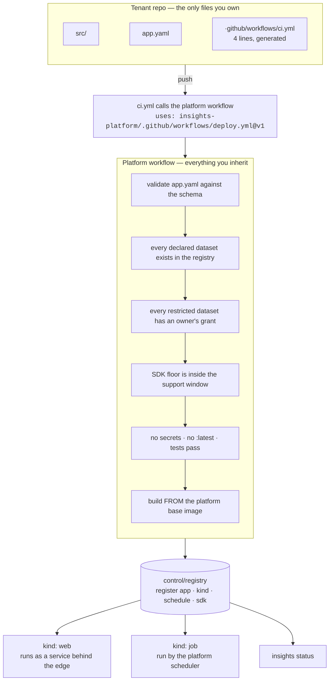
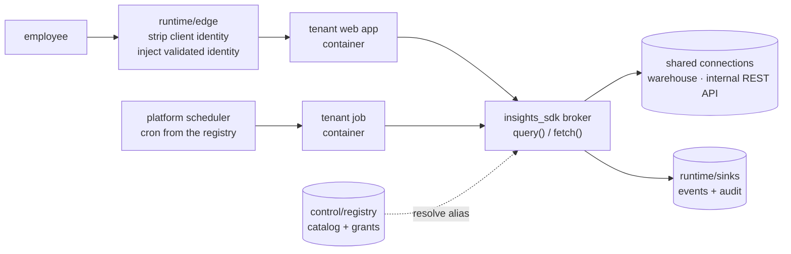
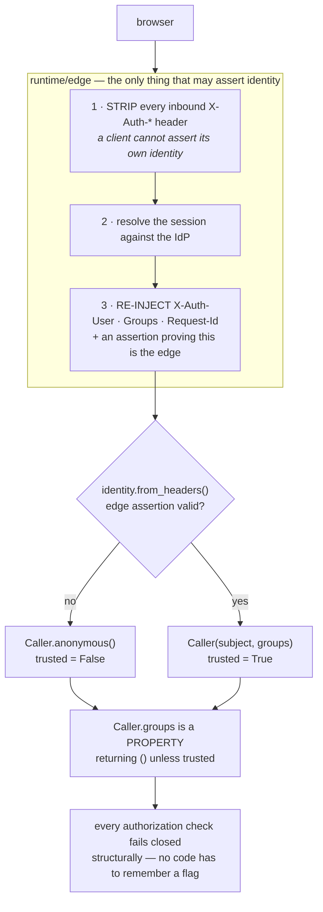
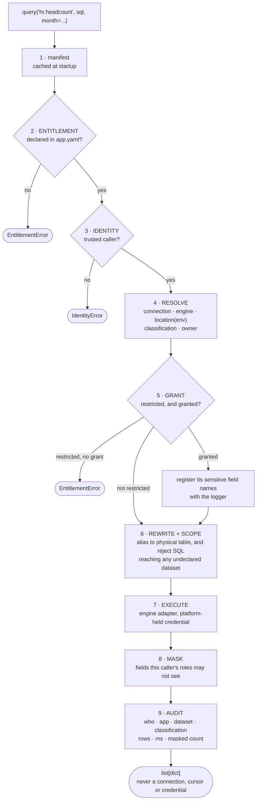

# Insights Hub — architecture

*The whole system in one document: what it is, how a request and a deploy flow through it, and
where every decision behind it is written down. This records no decision of its own — the five
[ADRs](adr/) do that, each one severable so it can be superseded on its own. Read this first, then
go argue with whichever ADR you disagree with.*

---

## Everything traces back to the brief's context section

The brief said those bullets were "not flavor text" and that the design would be evaluated
against them. So here is every one, and what it forced. Three are **forces** that shape
decisions; three are **requirements** that had to be delivered.

| # | What the brief said | What it forced | Lands in |
|---|---|---|---|
| 1 | *"The platform team is **2–3 engineers**, who also maintain, upgrade, and support everything they build."* | **Force.** Ruthless restraint — every component is something to patch and be paged for | ADR-001, ADR-004, ADR-005 |
| 2 | *"Every tenant is a **team of employees**… observability into what runs, and **organisational recourse**."* | **Force.** Threat model is **accident, not attack** → share infrastructure aggressively | ADR-002 |
| 3 | *"**~5 consuming teams today, plausibly ~25 in two years.**"* | **Force.** Must work at 25 without 5× the platform effort — which rules out anything per-tenant | ADR-002, ADR-005 |
| 4 | *"Apps share common needs… **authN/authZ**, **shared data connections** (a warehouse, an internal REST API), a **deployment story**, and a **baseline of observability**."* | **Requirement.** The four things the substrate must actually provide — see the table below | all five |
| 5 | *"**Teams vary.** Some will ship interactive CRUD web apps; others, scheduled batch jobs."* | **Requirement.** Two archetypes that must not become two platforms | ADR-001 |
| 6 | *"**People Analytics**… compensation data… their **compliance partner will review** your design before they onboard."* | **Force, and the counterweight.** Least privilege and **evidence** for one dataset | ADR-002, ADR-003 |

Forces 1, 2 and 3 all point the same way — *share everything, keep it small*. Force 6 pulls hard
the other way. **The interesting parts of this design are where that collision gets resolved**,
and requirement 4 is where it gets resolved most sharply, because shared data connections are
exactly what compensation data cannot afford to share naively.

## The system in one page

**The tenant contract:** *you write your app logic and an `app.yaml`. Everything else is
inherited.*

**Deploying — how a tenant ships.**

**Serving — how a request is answered.**

> **The tenant writes `src/`, `app.yaml`, and a four-line CI caller. Everything else in both
> diagrams is inherited.**

**Four repositories:**

| Repo | Who touches it |
|---|---|
| `insights-sdk` | **Tenants**, as a dependency. Ships the library, the `insights` CLI and the scaffold templates together |
| `insights-platform` | **Platform team only.** `runtime/` · `control/` · `infra/` · the reusable CI workflow · these ADRs · ONBOARDING |
| `insights-headcount-dashboard` | Tenant — interactive web app |
| `insights-comp-report` | Tenant — scheduled job, restricted data |

**Two organising ideas, which most of the design falls out of:**

1. **Declare, don't wire.** The tenant declares *intent* — a dataset alias, a role, a schedule —
   and the platform resolves it to an engine, a credential, an access group, a cron. The tenant
   never writes a connection string or a deployment.
2. **Enforce at the earliest layer that makes a rule impossible to get wrong.** Generator, then
   SDK, then CI, then review, and documentation only as a last resort.

And the ownership line that follows from them: **you own your code, we own the road it travels
on.**

## Decision map — the brief's five questions

*The ADRs are written as decisions, not as answers to these five questions — each one cites the
constraints that forced it, the way an ADR would if there had been no brief. This table and the
one below it are the traceability surface, so nothing is dodged and nothing has to be hunted for.
One ADR does not map to one question: ADR-002 answers isolation **and** the shared-data-connection
requirement, and ADR-001 and ADR-004 together answer deployment.*

| The question | ADR | The call, in one line | The tension resolved |
|---|---|---|---|
| **Reuse mechanism** and the upgrade story with 12 apps depending on it — and, one layer down, how apps ship and run | [ADR-001](adr/0001-platform-shape-and-reuse-strategy.md) | Versioned SDK in its own repo, floor-not-pin, scaffolds **generated not cloned**; seven upgrade mechanisms with deprecation telemetry as the keystone. Deployment answers the same way: a four-line tenant caller into one platform-owned workflow | Tenant autonomy vs platform upgrade cost — we took the harder upgrade path to keep ownership where it belongs |
| **Isolation** — what's shared, what isn't, and what drew the line | [ADR-002](adr/0002-tenant-isolation-and-data-access.md) | The platform **brokers reads rather than handing out connections**, so the only real boundary is the data path — and the tier follows the *data's* classification, not the tenant. Classification lives in the platform catalog, never the tenant's manifest | Operability vs assurance — "employees + recourse" licenses sharing; compensation data buys back least privilege and evidence |
| **Operator access** — what the platform team can see and do | [ADR-003](adr/0003-operator-access-and-tenant-data.md) | Telemetry **structurally cannot carry payloads** (raises at emit); zero standing access to rows; break-glass that is time-boxed, dataset-owner-approved, audited and **tenant-notified** | Same tension, with the platform team as the subject — every control makes our own job harder |
| **Enforcement** — where the rules live and how we decided | [ADR-004](adr/0004-enforcement-and-platform-rules.md) | Earliest layer that makes it impossible to get wrong: generator → SDK → CI → review → docs last | Enforcement strength vs tenant freedom — no escape hatch round the broker, but platform gaps are treated as bugs |
| **Deliberate omissions** and their triggers | [ADR-005](adr/0005-deliberate-omissions-and-triggers.md) | Eleven things not built — portal, micro-frontend shell, policy engine, per-tenant infra, real cloud, multi-env promotion, agents, DR/SLOs, **data discovery**, **per-user passthrough / an HTTP data service**, and **federation to an enterprise data catalog** — each with a written trigger | Completeness vs honesty about who operates this |

## The two flows worth understanding in detail

Everything else in this document is context for these two.

### Identity — why an app outside the edge can read nothing

A scheduled job has no interactive caller, so the scheduler constructs
`Caller.service("svc:comp-report", groups=<manifest owners>)` — trusted, because the platform and
not a network client built it. Naming that explicitly matters; otherwise "who is the caller at
06:00?" gets answered by accident.

### Data — the connection is shared by being operated for you

The registry has two levels, and the distinction carries most of the design:

| | What it is | Named by tenant code? | Granted to anyone? |
|---|---|---|---|
| **connection** | a shared source the platform operates — one warehouse, one internal REST API | never | **no** |
| **dataset** | a named thing *inside* a connection, with an owner and a classification | yes, in `app.yaml` | yes — the unit of entitlement |

Steps 2, 5, 6, 8 and 9 are only enforceable because there is exactly **one** code path to data.
That is the reason the platform brokers reads instead of handing out connections, and it is the
single decision the rest of the design rests on ([ADR-002](adr/0002-tenant-isolation-and-data-access.md)).

### The two archetypes, and why they are not two platforms

*"Teams vary. Some will ship interactive CRUD web apps; others, scheduled batch jobs."* The
cheapest way to satisfy that sentence is two parallel paths. We deliberately built one.

| | `kind: web` | `kind: job` |
|---|---|---|
| Tenant writes | request handlers | a `main()` |
| Tenant calls | `web_app()` | `run_job(main)` |
| Identity | per request, from the edge | per run, a service caller the scheduler constructs |
| Started by | the runtime, on a port | `runtime/scheduler`, from the registry + a cron line |
| Gets for free | routing, sign-in, request ids, access logs, `/healthz` | a run id, start/finish telemetry, SIGTERM draining, an exit-code contract |

**What is identical:** the SDK, the data broker, the telemetry rules, the base image, the
Dockerfile, the CI workflow, and the entrypoint. `kind` selects a branch in one
`entrypoint.sh`, so the two archetypes cannot drift apart — and a team that needs both writes
two manifests rather than learning two platforms.

**What makes `kind` real rather than decorative:** a job must declare a `schedule` and a web app
must not. The manifest loader rejects either mistake. Jobs are never deployed as services; the
registry records the schedule and the platform runs them.

The one genuinely different question is the one above: a scheduled run has no human, so its
identity and its masking roles had to be answered separately — see
[ADR-002 §3](adr/0002-tenant-isolation-and-data-access.md).

*The decision behind this table, and the three deployment models rejected to reach it, are in
[ADR-001](adr/0001-platform-shape-and-reuse-strategy.md).*

## Where the brief's four shared needs are answered

The brief names four things apps share. None of them is answered only by code.

| Shared need | Mechanism | Decided in |
|---|---|---|
| **authN / authZ** (stub SSO) | Trusted edge strips client-supplied identity headers and re-injects authorizer-validated ones; the SDK's `Caller` is **untrusted** without them and every group check then returns empty, so authorization fails closed. Two layers: platform membership, then `<app>-admin` / `<app>-user` groups derived from the manifest | ADR-004 (placement), ADR-002 (what identity reaches the data) |
| **Shared data connections** — a warehouse and an internal REST API | The platform **brokers the read**; it never hands out a connection. Tenants name a logical dataset, the platform resolves engine, location, credential, classification and owner. Two engines, one enforcement path | **ADR-002** |
| **Deployment** | Four-line CI caller in the tenant repo → one central reusable workflow that validates, checks entitlement, builds on the platform base image and registers the app. Jobs are registered and run by the platform scheduler, not deployed as services | ADR-001, ADR-004 |
| **Observability** | SDK logger auto-stamps app/team/env/request-id/caller/SDK version; **redaction raises at the emit point** rather than being scrubbed in the sink; a separate audit stream records every read | ADR-003 |

## The three calls most worth arguing with

If you have limited time, these are where the design is most exposed and most deliberate.

**1. We broker data instead of sharing connections — and that is the expensive choice.** A shared
connection factory is cheaper to build, and it is what a tenant would prefer. We rejected it
because sharing a connection means sharing a credential, and then nothing stops the headcount
dashboard from selecting salaries. The cost is that the platform team owns every engine adapter
and becomes the queue a blocked tenant waits in. ADR-002 names that as our main scaling risk
rather than hiding it.

**2. Soft isolation is soft, and we say so.** ADR-002 states plainly that apps share a kernel, a
broker and a control plane, and that if the threat model were a hostile tenant this design would
be wrong. We took the brief's "employees and organisational recourse" sentence as the licence.
The restricted tier buys **least privilege and evidence, not a stronger wall** — and pretending
otherwise to a compliance partner would be the real failure.

**3. Multi-repo made our hardest problem harder, on purpose.** A monorepo would make upgrades
trivial. It would also put a 2–3 person platform team in the path of every tenant's code. ADR-001
takes the harder upgrade story and spends the design effort on making it survivable.

*Runner-up: no multi-environment promotion — and ADR-005 admits the trigger has arguably already
fired, because it is "the first tenant whose app affects a decision someone is accountable for",
which is People Analytics, i.e. now. It is next, not never.*

## Evidence map — every claim, and where it is enforced

The brief says working code matters as evidence that the design survives contact with reality.
This is that map. Each row is a claim made in an ADR, the code that makes it true, and the test
that fails if it stops being true.

| Claim | Enforced in | Proven by |
|---|---|---|
| A client cannot assert its own identity | `runtime/edge/main.py` strips `X-Auth-*`; `identity.from_headers` discards untrusted values rather than keeping them | `test_a_client_cannot_assert_its_own_identity` |
| An app outside the edge can read nothing | `Caller.groups` is a property returning `()` unless trusted — fail-closed as a data structure, not as a discipline | `test_an_app_run_outside_the_edge_can_read_nothing` |
| Knowing a dataset's name is not access | broker step 2, against the tenant's own manifest | `test_an_undeclared_dataset_is_refused` |
| The platform cannot be used as a discovery oracle | entitlement is checked *before* the catalog, so "doesn't exist" and "not yours" are the same error | `test_a_nonexistent_dataset_is_indistinguishable_from_one_you_may_not_have` |
| Declaring a restricted dataset is not enough | broker step 5 requires a grant written by the dataset owner | `test_declaring_a_restricted_dataset_is_not_enough` |
| SQL cannot reach past the declared dataset | broker step 6 rewrites the alias, then rejects any other dataset's name or table | `test_sql_cannot_reach_past_the_declared_dataset` |
| The same SQL is portable across environments | the alias resolves to a different physical table per environment | `test_the_same_sql_reads_a_different_table_in_a_different_environment` |
| A tenant cannot unmask its own restricted fields | a service caller's roles come from the **grant**, never from `access.roles` in its own repo | `test_a_job_without_a_granted_role_is_still_masked` |
| A tenant cannot declare its own data non-sensitive | `config._FORBIDDEN_ANYWHERE` rejects the manifest; `control/cli/gates.py` blocks the push | `test_entitlement.py`, and try it — the loader names the ADR |
| Telemetry cannot carry rows | `obs._reject_payloads` raises at emit | `test_a_log_record_cannot_carry_rows` |
| Restricted field names cannot appear in logs | armed by broker step 5 from the catalog's `sensitive_fields` | `test_reading_restricted_data_arms_the_field_assertion` |
| There is no way round the broker | nothing exports a connection — and a test asserts the *shape* of the SDK, so adding one fails CI | `test_no_escape_hatch.py` |
| The upgrade story is driven by data, not email | `deprecation.py` emits once per symbol, naming app, version and symbol | `test_deprecation_telemetry.py` |
| Generated files can be re-generated | `insights upgrade-scaffold` re-renders exactly the platform-owned files | run it — `--check` reports drift |

Two of these exist *because* the code was written rather than only designed:

- **The service-identity question.** A scheduled job has no human, so "may this caller see
  salaries?" cannot be answered from corporate groups. The first implementation gave the job the
  manifest's `access.roles` — which lets a team unmask compensation by editing a line in its own
  repository. The roles now come from the grant.
- **The discovery oracle.** A test originally asserted that an unknown dataset raised a distinct
  error. It failed, correctly: distinguishing "doesn't exist" from "not yours" would let any
  tenant enumerate the registry by guessing names.

## Reading order

1. This page
2. [ADR-002 Tenant isolation and data access](adr/0002-tenant-isolation-and-data-access.md) — the central tension, and the decision everything else rests on
3. [ADR-003 Operator access](adr/0003-operator-access-and-tenant-data.md) — the same tension with us as the subject
4. [ADR-001 Platform shape and reuse](adr/0001-platform-shape-and-reuse-strategy.md) — what the substrate is, and how code reaches it
5. [ADR-004 Enforcement](adr/0004-enforcement-and-platform-rules.md) · [ADR-005 Omissions](adr/0005-deliberate-omissions-and-triggers.md)

Then [`ONBOARDING.md`](../ONBOARDING.md) for what all of this looks like to team #6 on day one.
