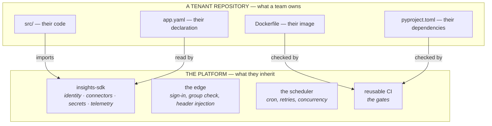
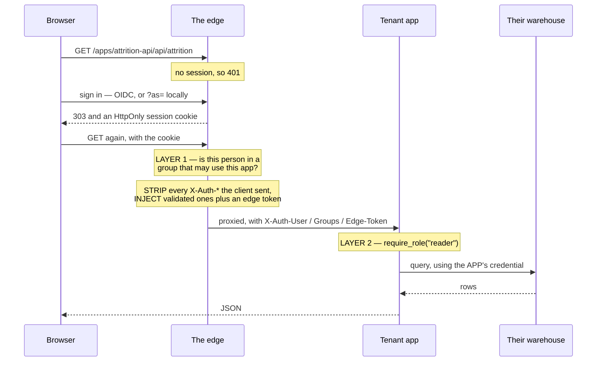
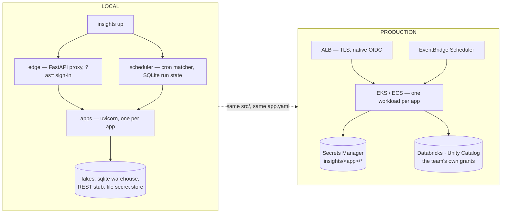

# Insights Hub — architecture

What this platform is, what it deliberately is not, and why each line was drawn where
it is. Decisions live in [the ADRs](adr/); this page is the map.

---

## 1 · The problem

A three-person platform team supports a growing number of analytics apps across BMS.
Each app is small — a dashboard, a scheduled report, an internal API — and each one
otherwise re-invents the same six things: sign-in, authorization, a connection to a
system the team already has access to, somewhere to keep the credential, logging, and
a deployment pipeline.

Three people cannot operate three hundred snowflakes. They also cannot review three
hundred teams' code. The platform therefore has to make the right thing the *default*
rather than the *reviewed* thing.

---

## 2 · The shape: an SDK, not a service



### "Why an SDK instead of a central service?"

A central data service is the obvious alternative: one API in front of everything,
every read passing through it. We rejected it, and the reason is operational rather
than architectural.

| | Central service | SDK (what we built) |
|---|---|---|
| Availability | every app is down when it is down | no shared runtime to fail |
| Latency | an extra network hop on every read | a function call |
| Scaling | the platform team capacity-plans for everybody's load | each app scales itself |
| On-call | three people own an outage affecting three hundred apps | a team owns their own app |
| Upgrades | one deploy changes behaviour for everyone at once | opt-in, per app, at their pace |
| Debugging | "the platform is slow" | a stack trace in their own process |

The deciding argument: **a three-person team cannot be on the critical path of three
hundred apps at 3am.** A central service makes the platform team the single point of
failure for every reader in the company, and no amount of redundancy makes three
people a 24/7 rota.

The cost is real: upgrades become opt-in, so they are slower. Section 10 is how we
stop "opt-in" turning into "never".

### "But doesn't an SDK make security harder to enforce?"

It makes *some* things harder and some easier, and it is worth being precise about
which.

**What an SDK genuinely cannot do:** stop a determined tenant. The code runs in their
process. They can `import sqlite3` and open their own connection, or add `psycopg2`
and talk to their own database. No library prevents that.

**Why that matters less than it sounds.** Look at what they would be bypassing: *their
own* credential, reaching *their own* data, which they already have access to. The
platform never held the keys to anybody else's data, so there is nothing to steal by
going around us. This is the single biggest reason the data broker was removed
([ADR-002](adr/0002-tenant-isolation-and-data-access.md)) — it implied a containment
guarantee an in-process library could never actually make.

**What is enforced, and where:**

| Control | Where it lives | Can a tenant bypass it? |
|---|---|---|
| Who may reach the app at all | **the edge**, a separate process | **No.** Not their code |
| Identity of the caller | the edge strips and re-injects `X-Auth-*` | **No.** Headers they send are discarded |
| Secret custody | **IAM**, in the secret store | **No.** Not a library decision |
| Which app runs as which identity | derived `sp-<app>`, set at deploy | **No.** Not tenant-declarable |
| `require_role()` | the SDK, in their process | Yes — but only to widen access to *their own* app |
| No credential in `app.yaml` | the manifest loader **and** CI | Yes at runtime; CI stops it shipping |
| Redaction of telemetry | the SDK's logger | Yes, by writing their own logger |

**The pattern: everything that protects *other people* is outside the tenant's
process. Everything inside the SDK protects the tenant from their own mistakes.** That
is the honest division, and it is why the edge stayed a separate service even after
the broker was deleted.

---

## 3 · What a tenant writes

Two files. Everything else is generated or inherited.

### `app.yaml` — the declaration

```yaml
app: comp-report
team: people-analytics
kind: job                        # web | job

access:
  manage:
    owners:       [MG-PEOPLE-ANALYTICS]
    contributors: [MG-PEOPLE-ANALYTICS-ENG]
    readers:      []

runtime:
  size: medium                   # small | medium | large

connections:
  - name: hr-warehouse
    engine: sqlite               # databricks-sql | redshift | postgres | rest | sqlite
    path: ...
    secret: hr-warehouse-token   # a NAME. Never a value

job:
  schedule: "0 6 * * MON"
  timezone: Europe/Dublin        # explicit. "UTC vs local" causes one real incident per platform
  timeout: 30m
  retries: 2
  concurrency: forbid
  catchup: false                 # after an outage, do NOT fire a burst of missed runs
```

Four blocks: who manages it, what it connects to, how it runs, how big it is. The
manifest has shrunk three times, and each removal was the same discovery — the field
was a second copy of something stated elsewhere:

| Removed | Why | Where it lives now |
|---|---|---|
| `data:` + the catalog | teams already have access to their data | their own connection |
| `access.roles` | a second authorization vocabulary beside the three tiers | `access.manage` |
| `runtime.sdk` | uv.lock pins it and uv enforces it every build | `pyproject.toml` |
| `runtime.base` | the tenant owns the Dockerfile | the `FROM` line |
| `outputs[]` | bought a retention, cost a block of ceremony | `output()` + a default |

Each is **refused, not ignored**. A silently-dropped block is a team believing a rule
is in force when it is not.

### `src/main.py` — the code

```python
from insights_sdk import connect, get_logger, require_role, web_app

app = web_app()          # login, identity, structured logs, metrics and /healthz
log = get_logger()

@app.get("/api/attrition")
def attrition(month: str = "2026-09"):
    require_role("reader")
    rows = connect("hr-warehouse").query(
        "SELECT dept, headcount FROM hr_headcount WHERE month = :month", month=month
    )
    log.info("attrition_computed", month=month, departments=len(rows))
    return {"month": month, "departments": rows}
```

A job is the same, with `run_job(main)` instead of `web_app()`.

Not in either file: login, session handling, a credential, a host, logging setup, a
health endpoint, or a pipeline.

---

## 4 · The two archetypes

| | `kind: web` | `kind: job` |
|---|---|---|
| Started by | the edge, per request | the scheduler, on a cron |
| Runs as | **the signed-in user** | **`sp-<app>`**, a service identity |
| Gets | a route, sign-in, per-request identity | a cron slot, timeout, retries, concurrency control |
| Writes | HTTP responses | `output()` artefacts |

Web apps come in two shapes — `api` (JSON only) and `spa` (a backend plus the team's
own built bundle, served from the same origin). The SDK is a **library, not a
web-framework integration**, so `connect()` is a function call and behaves identically
in both.

**Two shapes we removed:** a Jinja `dashboard` type and `streamlit`. Both meant the
platform owning a UI framework on behalf of three hundred apps — Streamlit alone
needed a header shim for identity, a health sidecar, sticky sessions with a replica
cap, and a caching wrapper so one click was not one warehouse query. Four platform
mechanisms for one shape. The manifest loader **refuses** them rather than accepting
and failing at deploy.

---

## 5 · Identity: how a person reaches a row



**The trust model in one line: an app trusts identity only when the platform edge put
it there.** Anything a client sent is discarded, not merely distrusted.

Four failure modes, all verified live:

| Attempt | Result |
|---|---|
| No identity | `401` |
| Forged `X-Auth-User` + forged edge token | `401` — headers stripped before anything is added |
| Valid cookie + forged `X-Auth-Groups` | returns the caller's **real** groups |
| Bypass the edge, call the app port directly | `{"subject":"anonymous","trusted":false}` |

That last row is the design: running outside the edge is not "an app with no user", it
is an app where every check returns no. `Caller.groups` is a **property** returning
`()` unless `trusted` — fail-closed as a data structure, not as a discipline someone
has to remember. `connect()` requires a trusted caller for the same reason: the
credential belongs to the app, and should not be usable on behalf of nobody.

### SSO is added per app by adding nothing

There is no per-app auth configuration. An app declares *who may use it*:

```yaml
access:
  manage:
    owners: [MG-PEOPLE-ANALYTICS]
```

and the deploy pipeline reconciles those groups into the edge's authorization table.
The three tiers **nest** — an owner satisfies `require_role("reader")` — because the
alternative is listing owners in three places, and forgetting once is a lockout that
looks like a platform bug.

Locally the `?as=` stub stands in for the IdP redirect; in production it is ALB native
OIDC. The app only ever sees `X-Auth-*` from a trusted edge, which is why the
substitution costs nothing in `src/`.

---

## 6 · Data: connectors, not a broker

The platform ships the plumbing. The team owns the connection.

| Ours | Theirs |
|---|---|
| the driver, pooling, timeouts, TLS | which system, which database |
| error translation | the query |
| the secret binding | every row that comes back |
| telemetry *about* the connection | — |

A query leaves behind: which connection, which engine, how long, how many rows. **Not
the SQL.** SQL carries table and column names and often a literal in a `WHERE` clause,
so a platform-wide log of tenant SQL is a data inventory nobody consented to.

### Error translation is what earns the wrapper

Six driver signatures map to a message that names the connection, says what to check,
and says **who fixes it** — because on a multi-tenant platform the answer is usually
not the platform team, and a message that does not say so sends the ticket to the
wrong place.

```
ConnectionFailed: connection 'hr-warehouse' (postgres): the credential was rejected.
  Check the secret's value and that it has not expired or been rotated. Your team
  owns it - the platform stores the slot and cannot read it.
  driver said: FATAL: password authentication failed for user "svc_hr"
```

`auth` and `not_found` are the team's. `tls` and `network` are usually ours. The
console surfaces that split as `likely_owner` across the fleet.

### "Let's add support for another data source"

A new engine is a platform change, and a small one. Four steps:

1. **Add it to `_ENGINES`** in `connectors.py` — reuse `SqlConnector` for anything
   DB-API shaped (Redshift, Postgres, Snowflake, Databricks SQL), or add a class with
   a `query()` method for a different protocol.
2. **Add its driver signatures to `_SIGNATURES`** so its errors translate. The only
   part needing judgement: every driver spells "auth failed" differently and none
   expose a stable code.
3. **Document the options a team puts in `app.yaml`.** The options dict is passed
   through, so there is no schema to extend.
4. **The driver goes in the tenant's `pyproject.toml`**, not a platform image. Teams
   own their dependencies; vendoring every driver would mean every app carrying every
   team's drivers.

`SUPPORTED_ENGINES` is derived from `_ENGINES`, so the manifest loader and the deploy
gate both pick it up with no second list to update. A team naming an unsupported
engine gets a manifest error listing the supported ones.

---

## 7 · Secrets: the platform holds the slot, never the value

A team needs a credential. Somebody has to store it. If the platform team stores it,
three people can read every team's database password — and "we promise not to look" is
not a control.

```
app.yaml            secret: hr-warehouse-token        <- a REFERENCE
secret store        insights/comp-report/hr-warehouse-token
writes the value    the app's owning group
reads the value     sp-comp-report, on its own prefix only
CANNOT read it      the platform team, by explicit IAM Deny on insights/*
sees every read     CloudTrail, including ours
```

**Custody is a property of the thing issuing credentials, not of us choosing not to
call `GetSecretValue`.** An explicit `Deny` cannot be overridden by any `Allow`, so it
survives somebody later granting the platform role broad access by accident.

In the SDK, `Secret.reveal()` is the only path to the value. `str`, `repr`, f-strings
and `format` all give `<Secret name REDACTED>` — defence in depth behind the telemetry
rules, because the expensive leak is the one nobody wrote on purpose.

The manifest loader refuses `password`, `token`, `api_key`, `client_secret` and `dsn`
outright. `app.yaml` is in git; a credential there is in the history forever, and
"we removed it in the next commit" is not a remediation.

---

## 8 · Operability

| Question | Answer |
|---|---|
| Is it deployed? | `insights status` |
| Did it boot? | `insights logs --app X --startup` — the **process** log |
| What did it do? | `insights logs --app X` — the **telemetry** |
| Can it reach its systems? | `insights connections --probe`, and `/healthz` |
| Across the fleet? | the console, at `/apps/console/` |

The startup/telemetry split matters: an app that dies on import emits **no** telemetry,
so the structured view is empty and reads as "no traffic" rather than "crashed".

**Health checks the dependencies, not the process.** `/healthz` resolves every declared
connection and confirms the credential arrived — so the common production failure (a
deploy that starts fine and fails on first use) surfaces at the health check. It does
*not* run a query: one hitting the warehouse every 30 seconds across three hundred apps
is a load generator, and it turns someone else's outage into our own red dashboard.

**The console is a tenant of the platform.** It registers like any app, sits behind the
edge, and gets the same session cookie and group check. If the edge breaks, the tool
you would use to diagnose it breaks identically — a better bug to have than a console
that works when nothing else does. It shows **telemetry, never rows**: it cannot leak
what the platform never collected.

**Scheduler run state is SQLite**, not a dict in the process. `concurrency: forbid` and
fire-once-per-minute were true only within one process lifetime until it was; dedupe is
now a `PRIMARY KEY` constraint that survives a restart, with a reaper so one crash does
not block a job forever.

---

## 9 · What CI enforces

Every tenant repo's pipeline is a four-line caller onto a central reusable workflow.
The platform owns the pipeline even though it does not own the code.

| Check | Why it is in CI and not elsewhere |
|---|---|
| The manifest parses, and names the app being built | the generator gets it right; people edit afterwards |
| No `access.roles`, `runtime.sdk` or `runtime.base` | removed fields, refused rather than ignored |
| Every connection names a supported engine | a typo is otherwise a runtime failure at 06:00 |
| No credential embedded in a connection option | nothing at runtime can un-leak a committed secret |
| No secret pattern anywhere in the repo | same |
| `insights-sdk` is a range, not a pin, inside the N-2 window | only knowable against the platform's support window |
| The Dockerfile's base is pinned, not `:latest` | `:latest` means the build is not reproducible |
| The Dockerfile sets a non-root final `USER` | nothing at runtime undoes a root breakout |
| `uv sync --frozen` resolves | the lockfile must be current, or the image is not what you tested |
| Tests pass | — |

Some of these run **twice** — in CI and again in the SDK at runtime — because CI can be
bypassed and the runtime cannot.

**What CI deliberately does not check:** whether a connection actually works. The
deploy runner is not in the app's network and does not hold the app's credential, by
design. Reachability is `/healthz`'s job, from where the app runs, which is the only
place the answer means anything.

---

## 10 · Upgrades: how a platform change reaches a running app

Three mechanisms, because "a platform change" is three different things.

| What changes | How it reaches deployed apps | Tenant action |
|---|---|---|
| SDK behaviour | a version **floor**, not a pin (`>=0.1,<1`) | `uv lock --upgrade-package insights-sdk` |
| Generated files (CI, runbook) | `insights upgrade-scaffold` | review the diff, commit |
| The edge, scheduler, console | deployed by us | none |

**Nothing is forced.** `uv.lock` pins the exact version an app runs, so a release
cannot change a running app underneath it. That is the trade for an SDK — and these
four mechanisms are what stop "opt-in" becoming "never":

- **Floor, not pin.** `==` is refused. Patches and minors arrive on re-lock.
- **N-2 support window.** The deploy gate fails an app outside it, so a team finds out
  at their desk rather than on the day they need to ship urgently.
- **Expand/contract.** Add the new thing, deprecate the old, remove it a major later.
- **Deprecation telemetry.** A `@deprecated` call emits a record naming the call, its
  replacement, and the version it disappears in — so we know who is still on it
  *before* removing it, instead of finding out afterwards.

### "A tenant needs Python 3.10 and the platform supports 3.12"

Two parts, and the first is easy:

1. **The image is not the problem.** They edit one line — `FROM python:3.10-slim`.
   Nothing in the platform pins a tenant's interpreter, and no platform base image
   exists to be on the wrong version. CI checks only that the base is pinned and the
   final user is not root.
2. **The SDK is the problem, and it is real.** It declares `requires-python = ">=3.12"`,
   so `uv sync` refuses to install — clearly, at their desk, rather than subtly at
   runtime.

What we would actually do, in order: find out **why** — nine times in ten it is one
dependency without a 3.12 wheel, and usually already fixed upstream. If it is real,
**lower the SDK floor to 3.10**: nothing in it needs 3.12 beyond syntax we can avoid,
and the cost is one more CI matrix entry. If the blocking dependency will never
support 3.12, that is an argument for that app not being on this platform — better
said out loud than worked around.

What we would **not** do is maintain a second SDK major for one team. One version
line, and a support window generous enough that nobody is forced.

---

## 11 · Local vs production

Everything runs locally with `insights up` — no Docker, no cloud account, no
credentials. The recommended production stack is **AWS for the application layer,
Databricks for the data layer**.



| Concern | Local | Production | Changes in `src/` |
|---|---|---|---|
| Sign-in | `?as=` stub | ALB OIDC | nothing |
| Identity to the app | `X-Auth-*` from the local edge | `X-Auth-*` from the gateway | nothing |
| Connections | sqlite + a REST stub | Databricks SQL, Redshift, internal APIs | nothing |
| Secrets | a file per secret | Secrets Manager, IAM-scoped per app | nothing |
| Scheduling | Python cron matcher + SQLite | EventBridge → RunTask / CronJob | nothing |
| Telemetry | JSONL on disk | stdout → CloudWatch → observability | nothing |

**Networking, briefly.** An ALB terminates TLS and does native OIDC, which is why it is
the front door rather than API Gateway — API Gateway has no interactive login. Its
~100-rules-per-load-balancer quota breaks somewhere around 300 apps, so routing moves
into the cluster (Ingress or a Gateway API HTTPRoute) and the ALB becomes one target.
NLB appears only where PrivateLink or static IPs are required.

**On M2M, precisely:** Databricks workload identity federation consumes an **OIDC**
token. Kubernetes projects one (IRSA / Pod Identity); an ECS task role is IAM/SigV4 and
does not. So "no stored credential" is fully true on EKS and only mostly true on
Fargate, where a broker exchange is needed. That asymmetry is a documented EKS trigger
in [ADR-005](adr/0005-deliberate-omissions-and-triggers.md).

---

## 12 · What this platform is not

Each named with the trigger that would change our minds, in
[ADR-005](adr/0005-deliberate-omissions-and-triggers.md).

- **Not a data catalog.** No search, no schema browser, no lineage. Discovery belongs
  in the data platform, governed by the same grants.
- **Not a governance layer.** Unity Catalog owns owners, tags, grants, column masks and
  row filters — enforced on every path, including a notebook.
- **Not a portal.** The console is read-only; the CLI is the interface.
- **Not multi-language.** Python only. A second runtime doubles the base of everything
  above, for a team of three.
- **Not hard isolation.** Apps share a cluster and a control plane. The boundary is the
  credential and the identity, not the kernel — and we say so rather than implying more.

---

## Reading order

1. This page
2. [ADR-001](adr/0001-platform-shape-and-reuse-strategy.md) — SDK vs service, and the upgrade story
3. [ADR-002](adr/0002-tenant-isolation-and-data-access.md) — connectors, secrets, and what isolation means here
4. [ADR-003](adr/0003-operator-access-and-tenant-data.md) — what the platform team can see
5. [ADR-004](adr/0004-enforcement-and-platform-rules.md) — where each rule is enforced
6. [ADR-005](adr/0005-deliberate-omissions-and-triggers.md) — what we left out, and when to revisit
7. [ONBOARDING.md](../ONBOARDING.md) — day one for a new team
8. [RUNBOOK.md](../RUNBOOK.md) — day two for us
