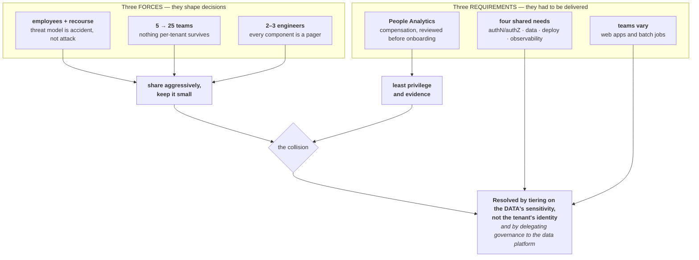
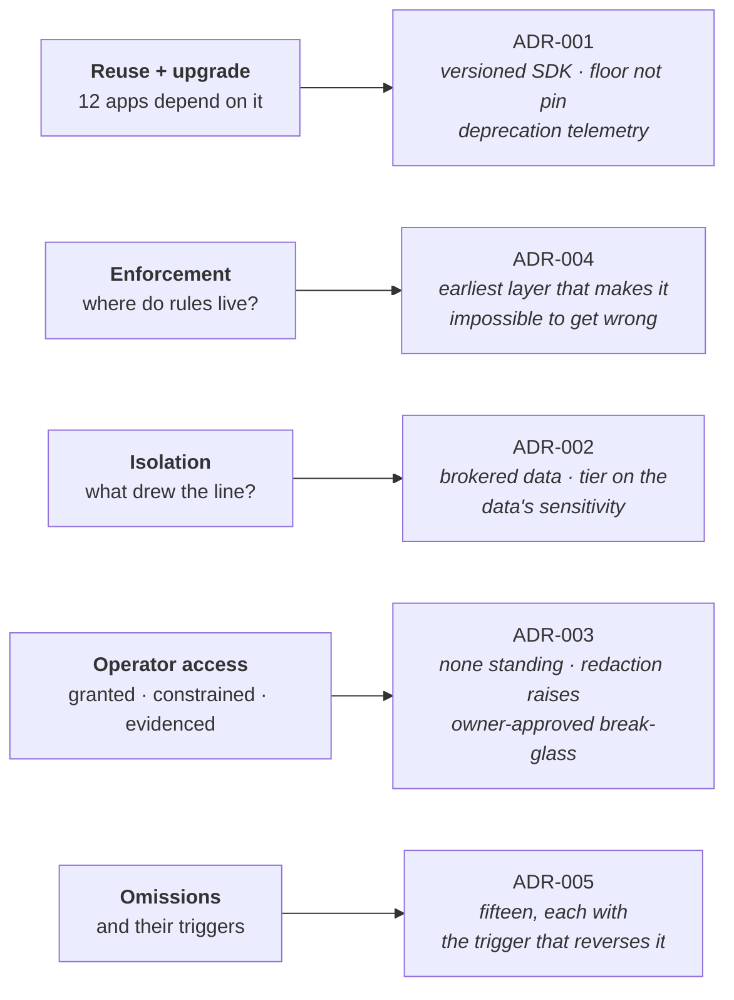

# How this submission answers the brief

Every constraint and every question, with what was built and where to check it.

The brief said its context bullets were *"not flavor text"* and that the design would be
evaluated against them. Three of them are **forces** that shape decisions; three are
**requirements** that had to be delivered. They are separated below because they were used
differently.

---

## Part 1 · The six context constraints



> **Everything interesting in this design is at that collision.** Three constraints say share;
> one says protect. Resolving it by tenant would have been the obvious move and the wrong one.

### 1 · "Every tenant is a team of employees. The platform is internal-only. You have observability into what runs, and organizational recourse when a team misbehaves."

**A force.** This is the single most load-bearing sentence in the brief, and it is quoted in
three ADRs.

It sets the **threat model: accident and casual over-access, not attack.** We are not defending
against a hostile tenant — a team that deliberately abuses the platform gets a conversation with
their manager, not a CVE. That licenses shared infrastructure, a shared runtime and a shared
data path, which is the only way two or three engineers operate a platform at all.

| What it licensed | Where |
|---|---|
| Soft isolation — shared kernel, cluster and control plane, stated plainly rather than implied | [ADR-002](adr/0002-tenant-isolation-and-data-access.md) § The tension |
| Accepting that the data credential sits in the tenant's own process | [ADR-003](adr/0003-operator-access-and-tenant-data.md) § The gap we cannot close |
| Organisational recourse as the *actual* control behind the broker bypass alarm | [RUNBOOK](../RUNBOOK.md) §5 |

**And the honesty test:** ADR-002 states that if the threat model were a hostile tenant, this
design would be **wrong**. The trigger that voids it is written down — a tenant that is not a
team of employees: a contractor team, a joint venture, an acquired entity. That reopens the ADR
rather than stretching it.

---

### 2 · "Scale: ~5 consuming teams today, plausibly ~25 in two years."

**A force.** Five is small enough that anything works; twenty-five is where per-tenant effort
breaks a small team. Every design choice was tested against twenty-five, not five.

| Decision | Because of 25, not 5 |
|---|---|
| No per-tenant infrastructure | 25 dedicated stacks would consume the whole team |
| One reusable CI workflow, called in four lines | Improving a pipeline is one commit, not 25 pull requests |
| A published base-image family, not per-app Dockerfiles | A CVE is one rebuild, not 25 pull requests |
| Deprecation telemetry | At 25 apps you cannot ask everyone what they use — you have to measure it |
| Groups derived from the manifest, never hand-created | Anything done by hand for 25 tenants is wrong for at least one, and nobody knows which |

**Where it breaks, written down:** ADR-004 says the manifest-review queue stops fitting three
people at roughly twenty-five tenants, and that the answer then is to move policy into data —
not to add reviewers.

---

### 3 · "The platform team is 2–3 engineers, who also maintain, upgrade, and support everything they build."

**A force**, and the one that justifies most of what was *not* built.

Every component is a component to patch, debug and be paged for. This is the explicit reason for:

| Choice | Alternative rejected |
|---|---|
| ECS Fargate | EKS — no cluster, no node pools, no add-on lifecycle ([ADR-005 #12](adr/0005-deliberate-omissions-and-triggers.md)) |
| Delegating governance to Unity Catalog | Owning our own classification and masking model ([ADR-002](adr/0002-tenant-isolation-and-data-access.md) alt. B) |
| No server-rendered UI framework | Jinja + a design system + `table()`/`chart()` helpers — a UI framework is not a thing three people should own |
| No policy engine, no portal, no service mesh | [ADR-005](adr/0005-deliberate-omissions-and-triggers.md), fifteen omissions |
| Documentation as enforcement of **last resort** | Rules in docs decay silently, and nobody has time to police them |

**The meta-trigger:** ADR-005 says the whole ADR should be reopened when the platform team grows
past three — because almost every omission is justified by who has to operate it, and that
justification ages quietly.

---

### 4 · "Apps share common needs. At minimum: authN/authZ (assume corporate SSO exists — stub it), access to shared data connections (e.g., a warehouse, an internal REST API — stub these with fixtures or fakes), a deployment story, and a baseline of observability."

**A requirement.** All four are built and run end to end against fakes.

| Need | What exists | Proof |
|---|---|---|
| **authN** — stubbed SSO | The platform edge. `?as=krishna@corp.example` sets a session; in production the ALB's OIDC action against Entra. The edge **strips every client-supplied `X-Auth-*` header** and injects verified ones | `test_a_client_cannot_assert_its_own_identity` · try the curl in the [README](../README.md) |
| **authZ** | Three layers: can you reach the app (edge) · can you do this (`require_role`) · may the **app** read this data (broker). `Caller.groups` is a property returning `()` unless trusted, so an app outside the edge fails every check structurally | `test_an_app_run_outside_the_edge_can_read_nothing` |
| **Shared data connections** | Two, deliberately different kinds: a **warehouse** (SQLite locally, Databricks SQL Warehouse in production) and an **internal REST API** (a 40-line stdlib stub). Same broker, same entitlement, same audit — different adapter | `test_the_wrong_verb_says_which_one_to_use` · `/api/team` in the example app |
| **Deployment** | Four generated workflows per app, four lines each, calling one reusable platform pipeline. Build once in dev; uat and prod promote that image | [ARCHITECTURE §8](ARCHITECTURE.md#8--deploying--dev-uat-prod) |
| **Observability** | Structured logs with app/team/env/request-id/caller/SDK auto-stamped · a separate audit stream · RED metrics per app · a generated dashboard per app · four alarms | [ARCHITECTURE §7a](ARCHITECTURE.md#7a--monitoring--enough-to-actually-operate) |

**The decision inside this requirement** is the one everything else rests on: *"access to shared
data connections"* was read as **the platform performs the read**, not *the platform hands you a
connection*. Sharing a connection means sharing a credential, and then nothing stops the
headcount dashboard reading salaries.

---

### 5 · "Teams vary. Some will ship interactive CRUD web apps; others, scheduled batch jobs."

**A requirement**, and the cheap way to satisfy it — two parallel paths — was deliberately not
taken.

|  | `kind: web` | `kind: job` |
|---|---|---|
| Example | [insights-headcount-dashboard](https://github.com/KRISHNABR/insights-headcount-dashboard) | [insights-comp-report](https://github.com/KRISHNABR/insights-comp-report) |
| Tenant writes | request handlers (+ their own frontend for `spa`) | a `main()` |
| Inherits | routing, sign-in, request ids, access logs, `/healthz` | a service identity, run id, timeout, retries, concurrency, SIGTERM drain, exit-code contract |

**What is identical:** the SDK, the broker, the telemetry rules, the base-image family, the CI
workflows, and a single `entrypoint.sh` that branches on `kind`. A team needing both writes two
manifests, not two mental models.

**`kind` is enforced, not decorative:** a job must declare a schedule and a web app must not —
the manifest loader rejects either mistake (`test_a_web_app_cannot_declare_a_job_block`). And a
job built on `python-data` has no web server in its image, so it cannot quietly become an
unmonitored API.

Web apps additionally come in two shapes — `api` and `spa` — a JSON backend, or a backend plus
the team's own built bundle. `web.type` selects the base image and how static files are served;
**it does not change how data is reached**, because the SDK is a library rather than a framework
integration. Shapes we refused (Jinja dashboards, Streamlit) are named with their reasons in
[ADR-005](adr/0005-deliberate-omissions-and-triggers.md) — the manifest loader rejects them
rather than accepting them and failing at deploy.

---

### 6 · "One early tenant is the People Analytics team. Their compensation data will be the most sensitive thing the platform holds, and their compliance partner will review your design before they onboard."

**A force, and the counterweight** to the first three. Constraints 1–3 all say *share
aggressively and keep it small*; this one pulls the other way, and the interesting parts of the
design are where that collision is resolved.

Resolved by **tiering on the data's sensitivity, not the tenant's identity**:

| Control | Where |
|---|---|
| Declaring a restricted dataset is not enough — the **data owner** must also grant it | [ADR-002 §4](adr/0002-tenant-isolation-and-data-access.md) · `test_declaring_a_restricted_dataset_is_not_enough` |
| A team cannot mark its own data non-sensitive — `classification` is rejected in a manifest at any depth | `test_mechanism_words_are_refused_at_any_depth` |
| A job's *unmasking* role comes from the grant, never its own manifest | `test_a_job_without_a_granted_role_is_still_masked` |
| Telemetry raises on a payload, and on any restricted **field name** | `test_reading_restricted_data_arms_the_field_assertion` |
| Platform team has no standing access to rows | [ADR-003](adr/0003-operator-access-and-tenant-data.md) |
| In production, Unity Catalog applies column masks and row filters on **every** path, including notebooks | [ADR-002 §2](adr/0002-tenant-isolation-and-data-access.md) |

**Because the reviewer sees the design before onboarding**, [`COMPLIANCE.md`](../COMPLIANCE.md)
is written to be argued with: ten controls each ending in something a reviewer can run or read,
a list of what was **not** built, and a section called *"the gap we cannot close"* that names the
residual risk before they find it.

> **Why not tier by tenant:** sensitivity travels with the data, not the team reading it. If
> People Ops gained compensation access tomorrow, tenant-based tiering would give that access
> standard-tier treatment — exactly backwards.

---

## Part 2 · The five questions




### Reuse mechanism, and the upgrade story with 12 dependants

**→ [ADR-001](adr/0001-platform-shape-and-reuse-strategy.md)**

Shared behaviour reaches apps as a **versioned Python package** in its own repo, installed as a
dependency. The CLI ships *inside* the SDK, so scaffold and library cannot skew. Scaffolds are
**generated, not cloned** — a cloned template can never be refreshed, because nothing knows
which files came from it.

The upgrade story rests on seven mechanisms, and one of them makes the rest safe:

| | Mechanism | Buys |
|---|---|---|
| 1 | Semantic versioning, published artefact | Teams choose when to move |
| 2 | **Floor, not pin** (`>=0.1,<1`) — `==` is rejected | Patches and minors flow with no tenant action |
| 3 | Expand / contract for breaking changes | Old and new coexist |
| 4 | **Deprecation telemetry** | *Who is on what, without asking* |
| 5 | SDK version per app in `insights status` | Drift is a glance, not a survey |
| 6 | Release notes + an **N-2 support window** | Stops supporting five versions forever |
| 7 | `insights upgrade-scaffold` | The scaffold gets an upgrade path, not just the library |

**Mechanism 4 is the keystone.** Without usage data, removing a deprecated API is a guess; with
it, a major is cut when the list empties rather than on a date. Proven by
`test_deprecation_telemetry.py`.

---

### Enforcement — where the rules live, and how each placement was decided

**→ [ADR-004](adr/0004-enforcement-and-platform-rules.md)**

**The rule: each rule goes to the earliest layer that makes it impossible to get wrong.**

| Layer | What lives here | Why there |
|---|---|---|
| **Generator** | repo layout, the four CI callers, `pyproject.toml`, `.gitignore` | If it is generated, it cannot be got wrong. There is no Dockerfile to generate — the platform builds the image, which is cheaper still |
| **SDK runtime** | credential handling, identity trust, entitlement, redaction | Must hold **even if CI is bypassed** |
| **CI** | manifest schema, entitlement vs registry, SDK support window, no secrets, no `:latest` | Must never **ship** |
| **Human review** | only manifest changes crossing a boundary: a new dataset, a new role, a change to `access.manage` | Few enough that three people can actually do them |
| **Documentation** | explanation and worked examples | **Last resort.** If a rule only exists in a doc, assume it is not enforced |

**The diagnostic that generalises:** *what does the platform's day-one guide have to warn people
about?* Every warning is a control sitting one layer too late. The health metric for this ADR is
the count of "remember to…" sentences in the docs.

Note data rules appear in **both** CI and runtime, deliberately — CI can be bypassed and the
runtime cannot.

---

### Isolation — what tenants share, what they don't, and what drew the line

**→ [ADR-002](adr/0002-tenant-isolation-and-data-access.md)**

| Shared by everyone | Never shared |
|---|---|
| VPC, cluster, ALB, the edge | their process and task role |
| The broker, the registry, the log sink | their data scope and grants |
| The CI pipeline and base images | their log group and dashboard |
| The Databricks workspace | their credentials — **they have none** |

**The fact that drew the line** is constraint 1: employees, with organisational recourse. That
made the threat model *accident, not attack*, which licensed sharing everything except the data
path. The data path is the only place a real boundary is drawn, and there the tier follows the
**data's sensitivity**, not the tenant's identity.

**Stated plainly rather than implied:** this is *soft* isolation. Apps share a kernel and a
control plane, so a container escape is a cross-tenant event. The restricted tier buys **least
privilege and evidence, not a stronger wall** — and telling a compliance partner otherwise would
be the real failure.

---

### Operator access — what the platform team can see and do, and how that is granted, constrained and evidenced

**→ [ADR-003](adr/0003-operator-access-and-tenant-data.md)**

| | Platform team can | |
|---|---|---|
| Telemetry — logs, metrics, traces, app metadata | **yes** | it is how we operate |
| Tenant data rows | **no** | no standing access exists |

**Granted:** a Unity Catalog grant from the **dataset owner** — never self-approved. The platform
team cannot approve access to data it does not own, and the CLI has no command that would let it.

**Constrained:** time-boxed, and in production a one-hour maximum `AssumeRole` session whose
trust policy the data owner controls.

**Evidenced:** every read writes an audit record; in production Unity Catalog's
`system.access.audit` is authoritative and the platform team cannot edit it. The tenant is
notified via an EventBridge rule on the AssumeRole event.

**The structural control**, and the reason this is not just policy: telemetry
**cannot carry payloads** — the logger *raises* at the emit point rather than being scrubbed at
the sink, because scrubbing at the sink fails open. Anything the scrubber does not recognise has
already left the process.

**What is honestly not built:** the break-glass `request`/`approve` commands. The data model,
the evidence trail and the compliance report all exist; the CLI verbs do not. ADR-003 has a
section saying exactly this, because `insights compliance-report` renders break-glass events and
could otherwise be read as "this works".

---

### Deliberate omissions, and what would trigger building them

**→ [ADR-005](adr/0005-deliberate-omissions-and-triggers.md)** — fifteen, each with a trigger.

| Not built | Trigger |
|---|---|
| Self-service portal | Onboarding becomes the bottleneck, not the substrate |
| Micro-frontend shell | Two teams need to compose each other's UI |
| Policy engine (OPA) | The manifest-review queue stops fitting three people |
| Per-tenant infrastructure | A tenant that is not a team of employees |
| Real cloud infrastructure | The first real environment |
| **Multi-environment promotion** | **Already fired** — People Analytics is exactly "a tenant whose app affects an accountable decision" |
| Agents / LLM features | Two or more tenants want the same thing |
| DR and SLOs | The first business-critical app |
| Data discovery in the app platform | None that leads back to us — discovery belongs in Unity Catalog |
| HTTP data service | The first tenant not on our language stack |
| Machine-to-machine exposure / API Gateway | The first system or agent calling an app as a tool |
| **Not on Kubernetes** | Workload-level policy, a mesh, per-tenant NetworkPolicy — **or the org already operating EKS as a shared service** |
| **No real IaC** | The first real environment. This is what most weakens "production grade" |
| No CSRF protection | The first state-changing endpoint. Both example apps are read-only |
| No Streamlit shape | The first team that asks. Refused by the manifest rather than accepted and failing at deploy |

**The one least comfortable to defend** is multi-environment promotion, because its trigger has
already fired. Everything is environment-aware and the workflows exist; they are simply not
exercised. It is first on the "what I'd do next" list.

---

## Part 3 · Where the evidence is

Every claim above maps to code and a test. The full table is in
[ARCHITECTURE § Evidence map](ARCHITECTURE.md#evidence-map--every-claim-and-where-it-is-enforced).

```bash
# 60 test cases, each turning an ADR claim into evidence
cd insights-sdk && uv run --with pytest --with pyyaml --with fastapi python -m pytest -q
```

The [verify workflow](../.github/workflows/verify.yml) runs all of it on every push — plus the
full stack and seven behaviour checks, including the two that must **fail**.

### Three things found by building rather than designing

These are the reason the code was worth writing, and none is visible from reading the design:

1. **A job has no human caller**, so "may this caller see salaries?" has no answer from corporate
   groups. The obvious fix — read `access.roles` from the manifest — lets a team unmask
   compensation by editing its own repo. Roles now come from the **grant**.
2. **An undeclared dataset and a nonexistent one must return the same error.** A test asserting
   otherwise failed, correctly: a differentiated error is a discovery oracle that lets any tenant
   enumerate the registry by guessing names.
3. **The rendered image never installed the tenant's own dependencies.** Everything passed until
   it ran. Found by the verify workflow, not by reading the code — which is the point of having
   one.
